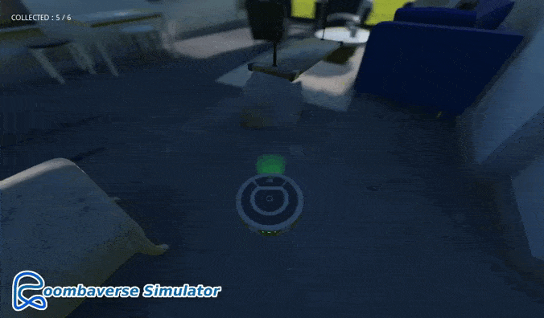
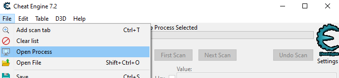
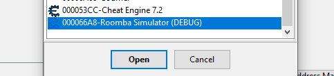
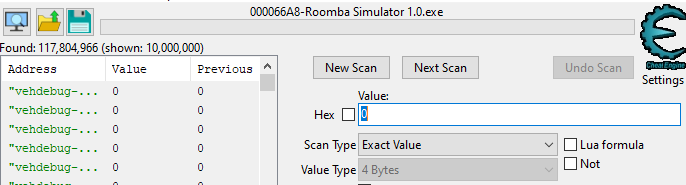
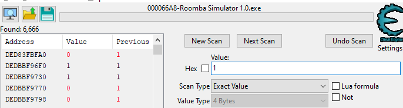
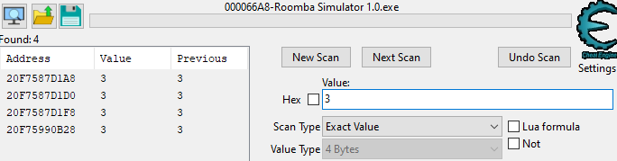
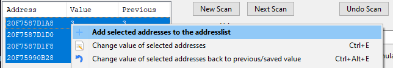
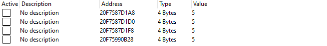
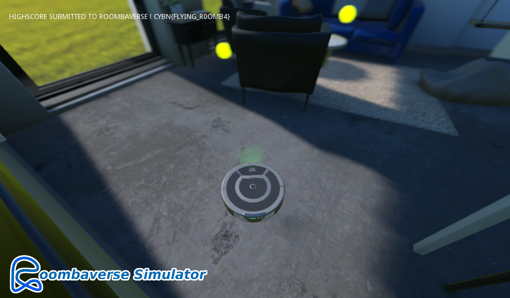


> **title:** Roombaverse Simulator - Roomba tricheur
>
> **category:** Misc
>
> **difficulty:** Moyen
>
> **point:** 50
>
> **author:** MrSheepSheep
>
> **description:**
>
> Terminez Roomba Simulator.
>
> 
>
> https://roombaverse.cybernight-c.tf/roombaverse-simulator

## Solution

Plusieurs façons de faire comme trouver un glitch dans le jeu ou modifier son score via un logiciel comme CheatEngine. Voici deux solutions :

### Glitch

La gravité est intentionnellement mal codée, ce qui permet en montant sur le pouf au sol de voler jusqu'au canapé pour récupérer la dernière boule jaune. 

### CheatEngine

Première étape on démarre le jeu et CheatEngine. Ensuite on attache le processus du jeu dans CheatEngine.

On fait une première recherche de notre score actuel (**0**) dans CheatEngine. Comme c'est une valeur entière, on peut parier sur le fait que c'est codé en tant que Integer, donc  4 bytes.

Maintenant on ramasse une boule jaune dans le jeu pour faire augmenter notre score à 1, puis on relance une recherche avec **Next Scan** sur la valeur 1.

6666 adresses compatibles, c'est trop donc on répète l'opération. On augmente notre score à 2 et l'on recherche la valeur, de mon côté je trouve une soixantaine d'adresses, donc je répète avec mon score à 3 et je trouve finalement 4 adresses :

Maintenant on ajoute ces adresses à notre liste :

On modifie la valeur des 4 adresses de notre liste en pour les mettre à 5 :

Enfin, on ramasse une boule jaune, ce qui incrémentera notre score à 6 :

**`FLAG : CYBN{FLYING_R0OMB4}`**


