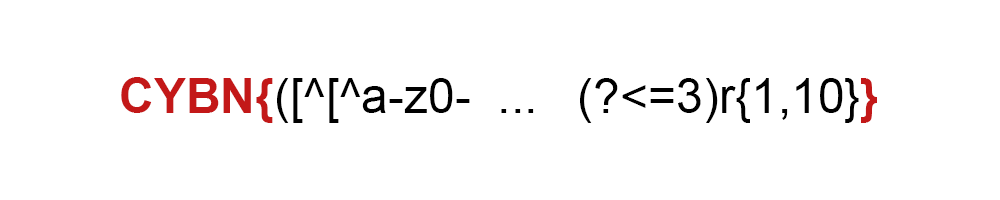


> **title:** Tinder
>
> **category:** Misc
>
> **difficulty:** Moyen
>
> **point:** 50
>
> **author:** Maestran
>
> **description:**
>
> Ca va être compliqué de match la :
>
> ```
>
> CYBN{([^[^a-z0-9A-X]|[^Z]])0{0}1{0}0{1}u{1}_(?#Ab^[1-4][5555-7-8-9-2]).(?<=4)[r-r]((((3_))))(?#[a-z]|[3-4]|[1-2])([t](h)[3](_))(?#.[a-Z0-5]...)t[r-r]u{1}((((3_))))r3g3x_(?#[a-z]|[3-4]|[1-2])([^[a-l]|[^n-z0-9A-X])0{0}1{0}4{1}st.(?<=3)r{1,10}}
>
> ```
>
> 

## Solution

L'idée est d'y aller vraiment pas à pas en découpant la regex. La première chose est d'identifier que les extrémiter sont statiques, il s'agit du format de flag **`CYBN{}`** :



Ensuite on continue de découper par bloc de gauche à droite :

**`([^[^a-z0-9A-X]|[^Z]])`**, on nous interdis tout sauf le **`Y`**.

**`0{0}`**, on voit 0{0} ce qui signifie que l'on veut 0 fois le charactère 0., pareil avec la suite **`1{0}`**, on veut 0 fois 1, **donc rien**.

**`0{1}u{1}_`** : **`0u_`**.

**`(?#Ab^[1-4][5555-7-8-9-2])`** : c'est un commentaire **donc rien**.

**`.(?<=4)`** : ?<= veut dire *lookbehind*, donc impose le . en tant que **`4`**.


**`[r-r]`** : Impose un **`r`**.

**`((((3_))))`** : Même si encapsulé dans 4 groupes, ça reste **`3_`**.

**`(?#[a-z]|[3-4]|[1-2])`** : Un commentaire encore **donc rien**.

**`([t](h)[3](_))`** : On nous impose **`th3_`**

**`(?#.[a-Z0-5]...)`** : Un commentaire **donc rien**.

**`t[r-r]u{1}((((3_))))r3g3x_`** : Un assemblage de ce qu'on a déjà vu, donc **`tru3_r3g3x_`**

**`(?#[a-z]|[3-4]|[1-2])`** : Un commentaire **donc rien**.

**`([^[a-l]|[^n-z0-9A-X])`** : Tout est interdis sauf le m, Y et Z (surement une erreur ou pour embêter), on peut donc choisir une des trois lettres, ici on part arbitrairement sur le **`m`**.

**`0{0}1{0}4{1}st`** : Encore un 0 et un 1 imposés 0 fois, puis un 4 une fois, donc **`4st`**.

**`.(?<=3)`** : Lookbehind comme tout à l'heure, donc **`3`**

**`r{1,10}`** : Entre 1 et 10 r acceptés, on part sur 1 seul pour faire simple, donc **`r`**.

Maintenant on assemble le tout et on obtient notre flag :

**`FLAG : CYBN{Y0u_4r3_th3_tru3_r3g3x_m4st3r}`**


