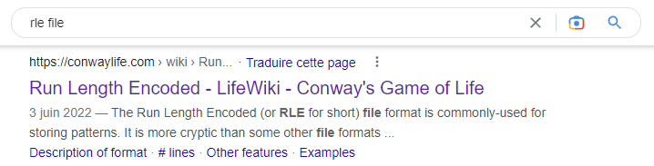
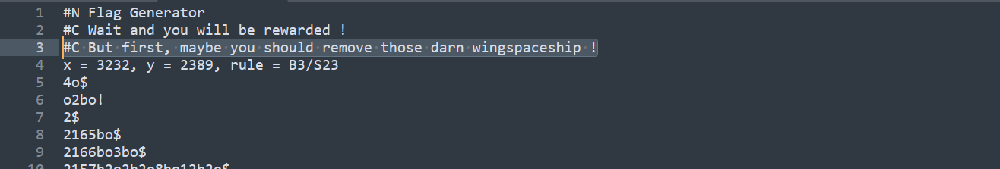
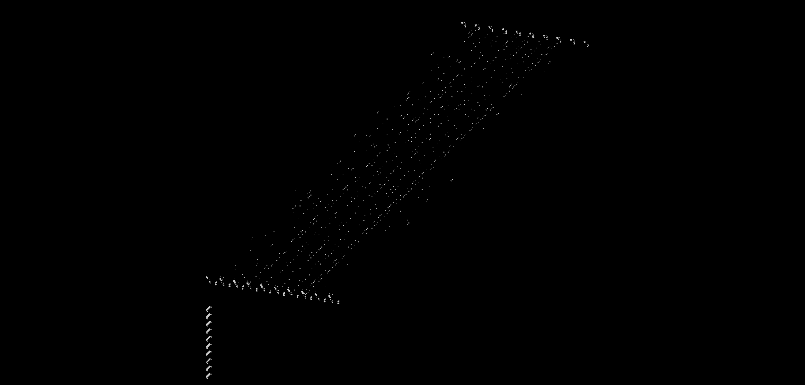
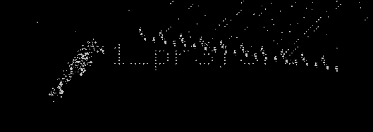
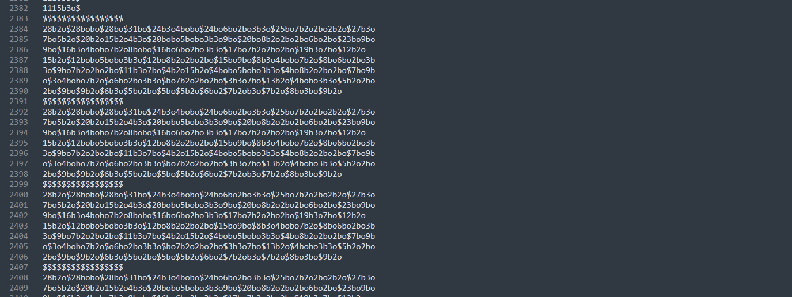
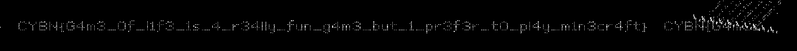


> **title:** riGOLe
>
> **category:** Misc
>
> **difficulty:** Moyen
>
> **point:** 50
>
> **author:** Maestran
>
> **description:**
>
> J'ai trouvé un fichier étrange, j'ai l'impression qu'il est vivant..
>
> Tu peux m'aider ?
>
> 

## Solution

On dispose d'un fichier **RLE**, avec une rapide recherche on trouve qu'il s'agit d'un format utilisé pour **le jeu de la vie**.

On peut tenter de le lire en cherchant un viewer sur internet, ici j'ai trouvé **[copy.sh](https://copy.sh/life/)**. En important le fichier, on tombe sur ce motif qui ne donne rien en lançant le jeu :

Si on ouvre le fichier en pour le lire, on peut voir un commentaire disant **`But first, maybe you should remove those darn wingspaceship !`**

En allant se documenter sur le format, on voit que le **`!`** signifie la fin du motif, hors là on voit très bien ligne 6 un **`!`**. On comprend donc que les lignes 5 et 6 correspondent au motif initial et bloquent la lecture du reste du fichier, **on supprime donc ces lignes** et on réimporte le fichier modifié :

En lançant le jeu, on voit que le flag s'écrire à mesure que ça avance :

Mais les 10 "vaisseaux" en bas s'entrechoquent avec l'écriture et viennent masquer la suite, **on cherche donc à modifier le fichier pour les retirer**. A la fin de celui-ci on voit des blocs qui se répètent, ils correspondent aux "vaisseux" donc on les supprime et on relance :

On voit maintenant correctement ce qui est écrit et en attendant un peu on voit le flag :

**`CYBN{G4m3_0f_l1f3_1s_4_r34lly_fun_g4m3_but_1_pr3f3r_t0_pl4y_m1n3cr4ft}`**


