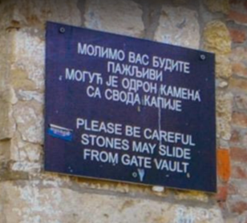


> **title:** Panneau
>
> **category:** Osint
>
> **difficulty:** Facile
>
> **point:** 25
>
> **author:** a
>
> **description:**
>
> Dans quel pays se trouve cette pancarte ?
>
> 
>
> Le flag que vous allez trouver n'est pas au format CYBN Vous pouvez l'ajouter entre CYBN{}

## Coming Soon...


