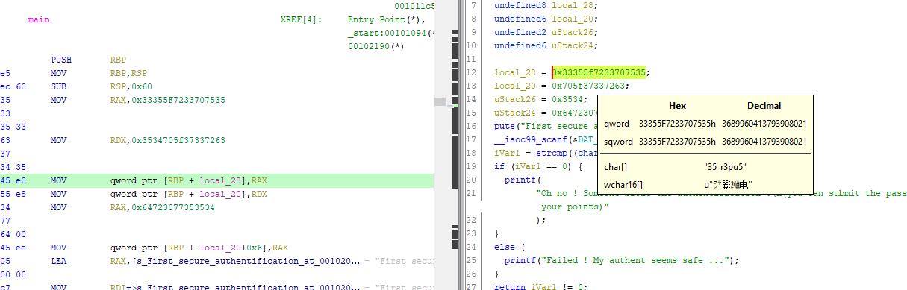


> **title:** Auth 1
>
> **category:** Reverse
>
> **difficulty:** Facile
>
> **point:** 25
>
> **author:** m00n
>
> **description:**
>
> Faire une authentification sécurisée ça doit pas être si difficile que ça, si ?  
>
> ``Le flag n'est pas au format cybn{}``
>
> 

## Solution

Plusieurs façons de faire :

### Strings

On utilise la commande **`strings`** sur le binaire, attention tout de même car un H est ajouté à la fin des charactères trouvés, ils sont a retirés.

```
┌──(kali㉿kali)-[~/Desktop]
└─$ strings auth1 | head -n 20 | tail -n 5
u+UH
5up3r_53H
cr37_p45H
455w0rd
First secure authentification attempt. Try to login:
```

### Ptrace

Il suffit de lancer la commande puis d'entrer n'importe quoi quand c'est demandé. On voit alors l'appel à strcmp avec les paramètres utilisés (dont le flag). *Merci à **m00n** AKA **Spray** pour le tips.* 

```
┌──(kali㉿kali)-[~/Desktop]
└─$ ltrace ./auth1                                                                                                                                       1 ⨯
puts("First secure authentification at"...First secure authentification attempt. Try to login:
)                                                      = 53
__isoc99_scanf(0x55ea0cceb03d, 0x7ffdef446680, 1, 0x7f9d5ec390d0edqz
)                                = 1
strcmp("5up3r_53cr37_p455w0rd", "edqz")                                                          = -48
printf("Failed ! My authent seems safe ."...)                                                    = 34
Failed ! My authent seems safe ...+++ exited (status 1) +++
```

### Ghidra

On analyse le binaire avec **Ghidra**, il devrait reconnaître de lui-même le type. On lance une analyse complète et ensuite en décompilant le main, on peut voir les différentes parties du flag en regardant les 4 variables consécutives :



**`FLAG : 5up3r_53cr37_p455w0rd`**


