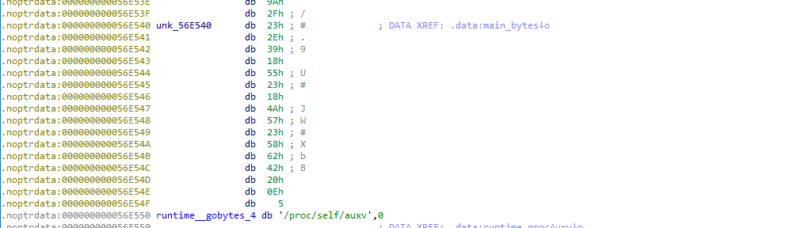


> **title:** Auth3
>
> **category:** Reverse
>
> **difficulty:** Très difficile
>
> **point:** 200
>
> **author:** m00n
>
> **description:**
>
> Bon cette fois, personne passe !  
>
> ``Le flag n'est pas au format cybn{}``
>
> 

## Solution

Ici nous allons faire uniquement du reverse statique avec IDA Pro (Ghidra gère moins bien le Golang).

### Préalable

On commence par lancer le binaire pour voir ce qu'il fait :


1. Il affiche 2 lignes de texte.
2. Nous devons entrer un mot de passe.
3. A nouveau 2 lignes de texte.

### Découverte du main

On passe à IDA où l'on peut voir 2 fonctions : **main.main** et **main.Encrypt**. Dans le **main** on peut trouver plusieurs lignes intéressantes :

- 13 à 18 : c'est de l'affichage classique, surement les 2 lignes qu'on a vu plus haut.
- 19 à 21 : c'est l'input utilisateur, qui est sauvegardé dans la variable **v3**.
- 22 à 24 : on appelle la fonction **Encrypt** avec notre input et ce qui ressemble à une clé. 


Si l'on regarde un peu le mode Graph de **main**, on voit qu'une comparaison est faite entre la sortie d'**Encrypt** et la chaîne **`Ueer3R2MamffxxG4QYJwSlKglEXRHscnnr0H0Veo`**. Le résultat de cette comparaison nous emmêne sur ce qui semble être les phrases d'échec et de réussite. **Notre but est donc de valider cette comparaison**.


### Découverte de Encrypt

Dans la fonction **Encrypt** on trouve plusieurs appels à d'autres fonctions mais ce qui intéresse c'est : **crypto_aes_NewCipher**,  **crypto_cipher_newCFB** et **encoding_base64_StdEncoding**.


Commencons par **newCipher**, en allant chercher sur la doc de Golang, on voit que la fonction prend un unique paramètre : la clé.


Dans mon screen la clé est stockée dans **v3** *(pas le même v3 que celui vu dans main juste avant)*. Ce **v3** est issu de la ligne juste au dessus avec la fonction **runtime_stringtoslicebyte** et utilise le paramètre **a2**, c'est à dire la string qu'on a vu dans le **main** et qui ressemblait à une clé, au moins **maintenant c'est confirmé**.

Maintenant **crypto_cipher_newCFB**, la doc ne renseigne pas sur cette fonction directement mais sur **newCFBEncrypter** et **newCFBDecrypter**. En cliquant sur l'une des deux fonctions sur la doc officielle, on peut aller voir le code source et trouver **newCFB** :


La fonction prend 3 paramètres : block, iv et decrypt. Ici on voit que lorsque l'on appelle la fonction nous passons plus de 3 paramètres, surement un problème de compréhension lors de la décompilation. On va donc chercher ce qui peut correspondre à quoi.

Tout à droite on voit un **0**, surement le paramètre **decrypt**, selon la doc cela veut dire que l'on est en mode **encryption** (ce qui correspond bizarrement au nom de notre fonction).

Ensuite en recherchant dans ces paramètres ce qui peut ressembler à un IV, on voit **main_bytes**. En cliquant dessus on trouve une référence à l'adresse **56E540**. Cette adresse contient étrangement 16 bytes consécutifs, on part du principe que c'est notre **IV**.



Enfin la dernière fonction intéressante : **encoding_base64_StdEncoding**. Le nom parle de lui-même, le résultat du chiffrement est encodé en Base64.

Donc on a trouvé :

- La clé : **`Y/:V#1qTM8iA6V+wYfj6:6U,`**
- l'IV : **`23 2E 39 18 55 23 18 4A 57 23 58 62 42 20 0E 05`**
- le secret chiffré et encodé : **`Ueer3R2MamffxxG4QYJwSlKglEXRHscnnr0H0Veo`**

Il ne reste plus qu'à faire l'inverse. Ici j'utilise un [compilateur de Go en ligne](https://go.dev/play/) et ne connaissant pas le language, j'ai repris [cet exemple](https://gist.github.com/STGDanny/03acf29a90684c2afc9487152324e832) en l'adaptant. Ce qui donne :

```Go
package main

import (
	"crypto/aes"
	"crypto/cipher"
	"encoding/base64"
	"fmt"
)

func main() {
	key := []byte("Y/:V#1qTM8iA6V+wYfj6:6U,")
	iv := []byte{0x23, 0x2e, 0x39, 0x18, 0x55, 0x23, 0x18, 0x4a, 0x57, 0x23, 0x58, 0x62, 0x42, 0x20, 0x0e, 0x05}
	cipherText, _ := base64.StdEncoding.DecodeString("Ueer3R2MamffxxG4QYJwSlKglEXRHscnnr0H0Veo")
	plainText := make([]byte, 30)

	block, _ := aes.NewCipher(key)
	stream := cipher.NewCFBDecrypter(block, iv)
	
	stream.XORKeyStream(plainText, cipherText)
	fmt.Printf("FLAG : %s\n", plainText)
}
```

**`FLAG : cyb3rn16h7_60_60_p0w3r_r4n63r5`**


