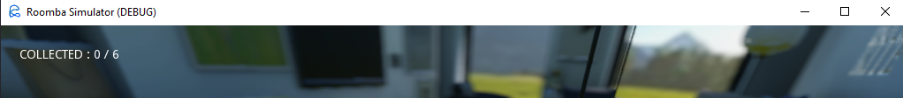
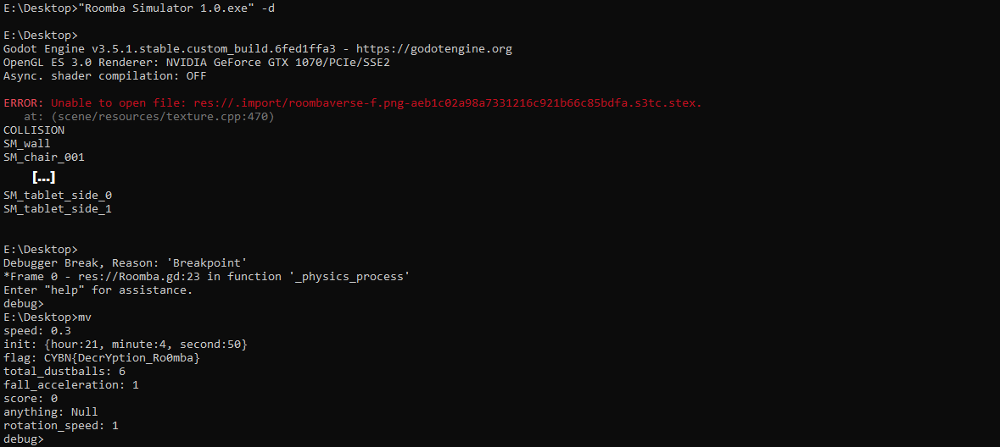
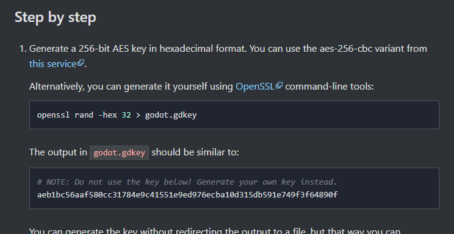
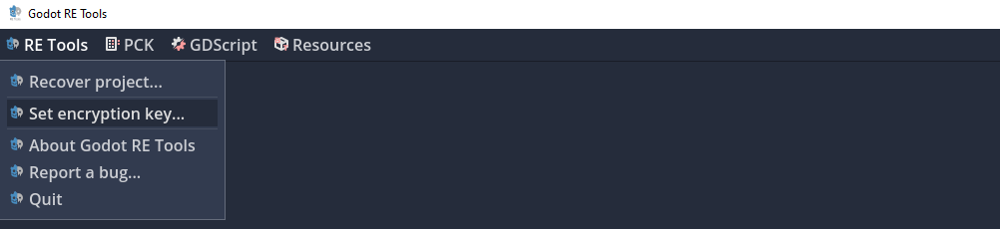
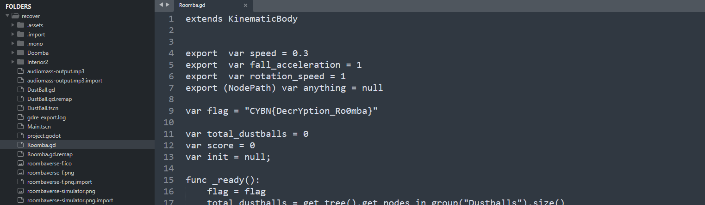


> **title:** Roombaverse Simulator - Cryptoroomba
>
> **category:** Reverse
>
> **difficulty:** Très difficile
>
> **point:** 150
>
> **author:** MrSheepSheep
>
> **description:**
>
> Un flag se trouve dans le binaire de Roomba Simulator.
>
> Indice : le binaire est chiffré
>
> 
>
> https://roombaverse.cybernight-c.tf/

## Solution

Il y a plusieurs façons de faire. Nous allons voir celle en utilisant le mode debug et celle en retrouvant la clé de chiffrement. Mais il est apparement possible de le faire en analyse statique et dynamique (*source : MrSheepSheep*).

Au préalable, il faut voir que l'exécutable a été fait avec la techno **[GoDot](https://docs.godotengine.org/en/stable/)**. On peut le découvrir simplement en testant la décompilation avec **[Godot RE Tools](https://github.com/bruvzg/gdsdecomp)**.

### Debugger

En lançant le jeu nous pouvons voir qu'il est en mode **debug** : 

Selon **[la doc](https://docs.godotengine.org/en/stable/tutorials/editor/command_line_tutorial.html?highlight=debug)**, on peut alors lancer en mode **CLI** le debugger du jeu.

De mon côté c'est vachement buggé, donc une fois la commande lancée, je dois faire Ctrl+C pour faire un **breakpoint** puis une fois sur deux je peux entrer la commande **`mv`** dans le debugger pour afficher les variables de la scène actuelle :

On voit alors la variable **`flag`**.

### Clé de déchiffrement

On nous dit que le binaire est chiffré, donc petit tour sur **[la doc](https://docs.godotengine.org/en/stable/development/compiling/compiling_with_script_encryption_key.html)** où l'on peut voir les étapes pour chiffrer les scripts lors de la compilation.

Dans la doc on peut y voir une clé avec la note **"Ne pas utiliser la clé ci-dessous"**. Il ne faut pas négliger la parfidie des auteurs de challenge et ça ne coûte que quelques secondes de la tester. On paramètre alors **[Godot RE Tools](https://github.com/bruvzg/gdsdecomp)** avec la clé et on lance la décompilation :

Aucune erreur, la clé est acceptée et on obtient le flag :

**`FLAG : CYBN{DecrYption_Ro0mba}`**


