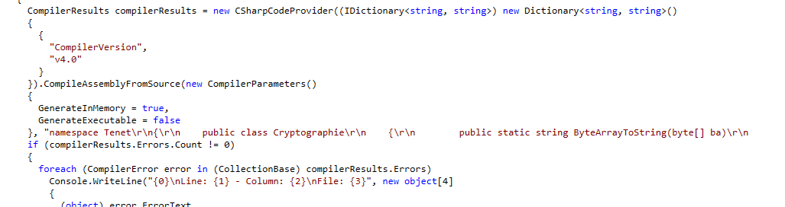


> **title:** TE.NET
>
> **category:** Reverse
>
> **difficulty:** Très difficile
>
> **point:** 200
>
> **author:** Cybiosity
>
> **description:**
>
> *"You were divided into two teams for a temporal pincer movement. We are Red team, moving forwards. Our friends out there – (gestures at containers) – Blue team, led by Commander Wheeler, are inverted. One hour from now, they had this briefing..."*
>
> 

## Solution

Comme son nom l'indique, il s'agit d'un executable **`.NET`**, je pars donc sur l'outils **`dotPeek`** pour le décompiler. Voilà l'architecture après décompilation : 

On a un namespace nommé **Tenet** et composé de 2 classes : **RXQgc2kgbGEgcHVy6WUgYSBjcmFt6Q** et **Stalsk12** qui contient la fonction **Main**.

Dans cette dernière fonction, on peut voir au tout début un passage un peu bizarre : il s'agit d'une compilation à la volée, c'est à dire que le code ne sera compilé qu'au moment de l'exécution.

On peut voir que ce code un peu spécial est une longue chaîne de charactère à laquelle on ajoute **`RXQgc2kgbGEgcHVy6WUgYSBjcmFt6Q.x()`** (*ça se trouve en fin de ligne*).

Allons voir ce que retourne cette fonction **x**, pour ça on la décompile (toujours avec dotPeek) et on copie colle bêtement l'intégralité du fichier dans un [compilateur en ligne](https://www.programiz.com/csharp-programming/online-compiler/) puis on appelle cette fonction :

En assemblant les deux parties récupérées, c'est à dire la longue chaîne de charatères trouvée dans **`Main`** + le résultat de la fonction **`x`**, on obtient un code qui ressemble à ça :

<a href="files/source.cs" class="btn">source.cs</a>

On y trouve 2 classes : **`RedTeam`** et **`BlueTeam`**. Dans cette première, on peut voir dans la fonction **Step2** trois variables intéressantes : **`_encryptedRedTeamFlagHex`**, **`_blueTeamKeyHex`** et **`_blueTeamIVHex`**.

Dans la fonction **Step5** on trouve un appel à la fonction **`DecryptStringFromBytes_Aes`**. On apprend donc que de l'AES est fait et on a visiblement l'IV et la clé de l'équipe bleu ainsi que le message chiffré de l'équipe rouge.

Allons maintenant voir la BlueTeam. On y voit la fonction **InvertedStep2** qui semble être très similaire à la **Step2** de la RedTeam.

Par ailleurs, trois variables sont au même endroit, partont du principe qu'il s'agit des mêmes que celles de la RedTeam mais inversées, donc dans l'ordre : **`_encryptedBlueTeamFlagHex`**, **`_redTeamKeyHex`** et **`_redTeamIVHex`**.

On peut tenter de déchiffrer **`_encryptedRedTeamFlagHex`** avec l'IV et la clé supposement trouvés dans la **`BlueTeam`**. Ici j'utilise [CyberChef](https://gchq.github.io/CyberChef/#recipe=AES_Decrypt(%7B'option':'Hex','string':'e08e42fc6601bf761ffa3f37df1f47a46f5d278ae13cb6b9d03ad892aca03e6a'%7D,%7B'option':'Hex','string':'755597fd4664886c95461fe821bbe108'%7D,'CBC','Hex','Raw',%7B'option':'Hex','string':''%7D,%7B'option':'Hex','string':''%7D)&input=ZTdjYTRlNTg1Yzg2NzQzZDU3MzM1NWJjMmQ3M2FjMWI4ZDg1NTExZTEzMDI0YjYxZGFjYzdjNGYyYWRhZTYwNA) (*le lien est paramétré avec les valeurs trouvées*):

**Bingo** c'est le début du flag, on fait la même chose avec le supposé **`_encryptedBlueTeamFlagHex`** et l'IV et la clé trouvées dans la **`RedTeam`**, [lien du déchiffrement](https://gchq.github.io/CyberChef/#recipe=AES_Decrypt(%7B'option':'Hex','string':'7688b8e374e868241f61da326be1eb022128f6c33c3ddd89dda1c7303744f4bf'%7D,%7B'option':'Hex','string':'80de9488c8ca4c10aebd7dd0475b28ce'%7D,'CBC','Hex','Raw',%7B'option':'Hex','string':''%7D,%7B'option':'Hex','string':''%7D)&input=NTI4YjQ1MGRiMWViOWU2YjBmMGIxMTZiOWMxZGUyN2ZiYTNlMWNiMDJiOWU2N2IyMTg5MjQ5ZjRmZTFiNmU5NTBjNmRjYTk1NTNlOTgxYTIwMzAwMTA1ZDQyYzhlNzJi) :

On assemble et c'est bon.

**`FLAG : CYBN{t3net_is_c0nfusing_af_4nd_1ts_actu4lly_n0t_that_g00d}`**


