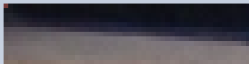


> **title:** 50 Shades of Stephane Legar
>
> **category:** Steganography
>
> **difficulty:** Difficile
>
> **point:** 100
>
> **author:** m00n
>
> **description:**
>
> 
>
> 

## Solution

On est sur un challenge de **stéganographie de niveau difficile**, il faut donc prendre son temps et bien tout regarder.

Dans les techniques très répondues on trouve **le LSB et le MSB**. L'un des réflexes est donc de **vérifier les bords de l'image**, notamment les zones blanches ou noires, à la recherche de pixel de mauvaise couleur. Si l'on prête suffisament attention, on peut voir que toutes les images ont **leur coin supérieur gauche un peu étrange**, cela se voit bien avec Paint sur *image6.png* :



Avec un petit script on peut facilement récupèrer l'ensemble de ces pixels :

```python
from PIL import Image
from os.path import join

BASE = r"path_to_folder"

for i in range(27):
	img = Image.open(join(BASE, f"image{i}.png"))
	print(img.getpixel((0, 0)))

# (99, 121, 98, 120)
# (110, 123, 51, 127)
# [...]
# (108, 109, 52, 214)
# (48, 125, 0, 236)
```

En transformant les valeurs de R, G et B (pas le canal Alpha) selon la norme ASCII, on obtient le flag :

```python
from PIL import Image
from os.path import join

BASE = r"path_to_folder"

flag = ""
for i in range(27):
	img = Image.open(join(BASE, f"image{i}.png"))
	r, g, b, a = img.getpixel((0, 0))
	flag += chr(r) + chr(g) + chr(b)
print(flag)

# cybn{3n_vr41_1l_d4n5417_p45_51_b13n_qu3_c4_1l_f3r4_m13ux_l4_pr0ch41n3_f015_lm40} 
```

**`FLAG : cybn{3n_vr41_1l_d4n5417_p45_51_b13n_qu3_c4_1l_f3r4_m13ux_l4_pr0ch41n3_f015_lm40} `**


