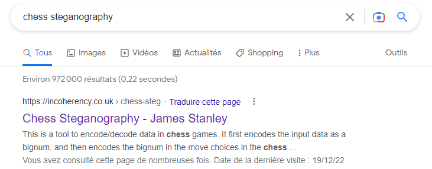
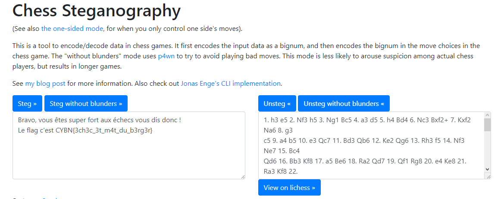


> **title:** Chess Master
>
> **category:** Steganography
>
> **difficulty:** Facile
>
> **point:** 25
>
> **author:** Maestran
>
> **description:**
>
> Juste des parties d'échecs, rien de suspect ici...
>
> 

## Solution

Le zip contient plusieurs fichiers .pgn. Avec quelques recherches on découvre qu'il s'agit de **Portable Game Notation**, un format standard de codage des parties d'échecs.

En continuant les recherches, on peut voir qu'un outil existe pour cacher du texte dans des parties d'échec :

Tous les fichiers sont similaires sauf un se terminant par **{ White resigns. }**. En passant les coups joués dans l'outils, on récupère le flag :

**`FLAG : CYBN{3ch3c_3t_m4t_du_b3rg3r}`**


