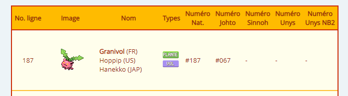


> **title:** Deviens champion sers toi de tout ce que tu as appris
>
> **category:** Steganography
>
> **difficulty:** Moyen
>
> **point:** 50
>
> **author:** Lmeaou
>
> **description:**
>
> hey, vous connaissez chat GPT, le site ou on peut discuter avec une IA ? je lui ai fait écrire ce petit dialogue tout à l'heure, c'est sympa non ?
>
> Salut, j'ai vu un granivol tout à l'heure dans le jardin.
>
> Moi, j'ai vu un abra près du parc.
>
> Ah oui ? J'ai aussi vu un empiflor dans les bois.
>
> Cool ! Et moi, j'ai rencontré une Poissirène au bord de l'étang.
>
> Waouh, c'est génial ! Moi, j'ai croisé un Snubull sur le chemin du retour.
>
> Impressionnant ! J'ai aussi vu un Héliatronc voler au-dessus des arbres.
>
> C'est vraiment fascinant ! Et toi, tu as vu quelque chose d'intéressant ?
>
> Oui, j'ai vu une Sabelette courir dans l'herbe.
>
> Et moi, j'ai vu deux Tadmorvs se pourchasser dans les hautes herbes.
>
> C'est rigolo ! J'ai aussi vu un Insolourdo près de la rivière.
>
> Moi, j'ai vu une Nidoran♀ dans les buissons.
>
> Ah oui ? J'ai vu un Nidorino à l'orée de la forêt.
>
> Oui, c'est vraiment cool ! Et toi, tu as vu quoi d'autre ?
>
> J'ai vu un autre Insolourdo et un Tadmorv se battre.
>
> Intéressant ! Moi, j'ai vu un Nidorino qui chassait une Noeunoeuf, il était aidé par une Nidoran♀.
>
> Oh oui, c'était fascinant ! Et toi, tu as vu quelque chose d'intéressant ?
>
> Oui, j'ai vu un Arbok se faufiler dans les buissons.
>
> Ah oui ? Moi, j'ai vu un Aéromite voler au-dessus des arbres.
>
> C'est génial ! Et toi, tu as vu quelque chose d'intéressant ?
>
> Oui, j'ai vu une Nidoran♀ se cacher dans les fougères.
>
> Ah oui, c'est intéressant ! Et moi, j'ai vu un Insolourdo se reposer sous un arbre.
>
> Cool ! Et moi, j'ai vu deux Mimitoss sauter dans les hautes herbes.
>
> Oui, c'était vraiment sympa ! Et toi, tu as vu quoi d'autre ?
>
> J'ai vu un Goupix se faufiler dans les broussailles.
>
> Ah oui, c'est super ! On a vu plein d'espèces intéressantes aujourd'hui.
>
> 

## Solution

La plupart des phrases de la conversation contiennent des noms de pokémon. Le tout premier est **Granivol**.

En cherchant le numéro de ce pokemon dans le pokedex, on voit qu'il en existe plusieurs. Selon le pokedex, son numéro est :
- National : 187
- Johto : 67



Etrangement, **67** est aussi le numéro ASCII de la lettre **`C`**, la première lettre de CYBN{...}.

Regardons pour le dernier pokemon de la conversation : **Goupix**
Son numéro est le 125 dans le pokedex de Johto des version Or et Argent, mais 127 dans celui de HearthGold et SoulSliver.


Le numéro ASCII de **`}`** étant **125**, on sait maintenant qu'il faut utiliser **le Pokedex de Johto de la version Or et Argent**.

Prenons maintenant dans l'ordre la liste des pokémons cités dans la conversation, en comptant deux fois le pokemon lorsqu'il est écrit *"deux Tadmorvs"*, et faisons correspondre leur index pokedex :

```
Granivol	: 67
Abra		: 89
Empiflor	: 66
Poissirène	: 78
Snubull		: 123
Héliatronc	: 103
Sabelette	: 48
Tadmorv		: 116
Tadmorv		: 116
Insolourdo	: 52
Nidoran♀	: 95
Nidorino	: 99
Insolourdo	: 52
Tadmorv		: 116
Nidorino	: 99
Noeunoeuf	: 104
Nidoran♀	: 95
Arbok		: 51
Aéromite	: 109
Nidoran♀	: 95
Insolourdo	: 52
Mimitoss	: 108
Mimitoss	: 108
Goupix		: 125
```

Maintenant pour chaque index du pokedex obtenu, on prend la lettre correspondante selon la norme ASCII :

**`FLAG : CYBN{g0tt4_c4tch_3m_4ll}`**


