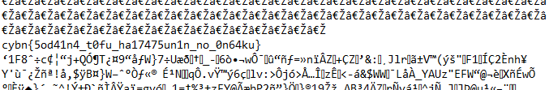


> **title:** Drifting in the bits
>
> **category:** Steganography
>
> **difficulty:** Moyen
>
> **point:** 50
>
> **author:** m00n
>
> **description:**
>
> 
>
> 

## Solution

En faisant la commande **`file vrrrrm.mp3`** ou en allant sur un site comme **[Metadata2Go](https://www.metadata2go.com)** on pouvait voir que le fichier n'est pas un MP3 mais un **WAV**.


Dans les outils très connus en stéganographie audio (ou en faisant 1 recherche google) on a **[stego_lsb](https://github.com/ragibson/Steganography)**.

Cet outil permet d'appliquer la technique du LSB sur un fichier WAV grâce à son module **WavSteg**. Voici la commande à faire pour récupérer les données cachées (lire la doc de l'outil pour avoir des précisions) :

```
stegolsb wavsteg -r -i vrrrrm.mp3 -o out.txt -b 5000000
```

Ensuite on avait un padding de **4 071 528 bytes** *(en réalité c'était même E2 80 8E qui était répété 1 357 176 de fois)* puis après un retour à la ligne (0x0A) se trouve le flag :



**`FLAG : cybn{5od41n4_t0fu_ha17475un1n_no_0n64ku}`**


