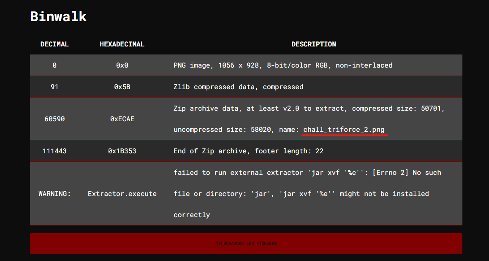
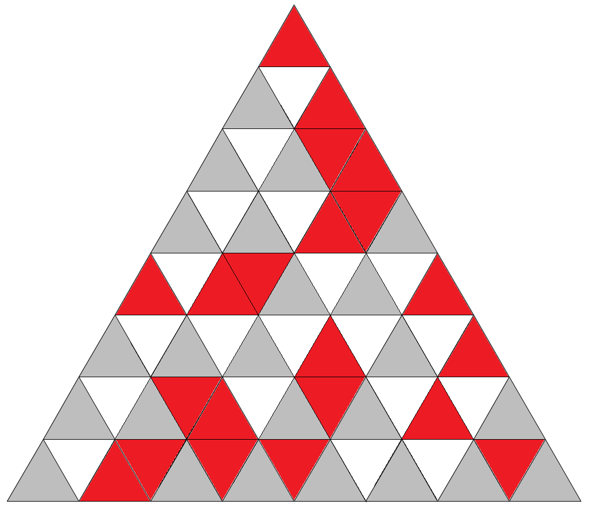
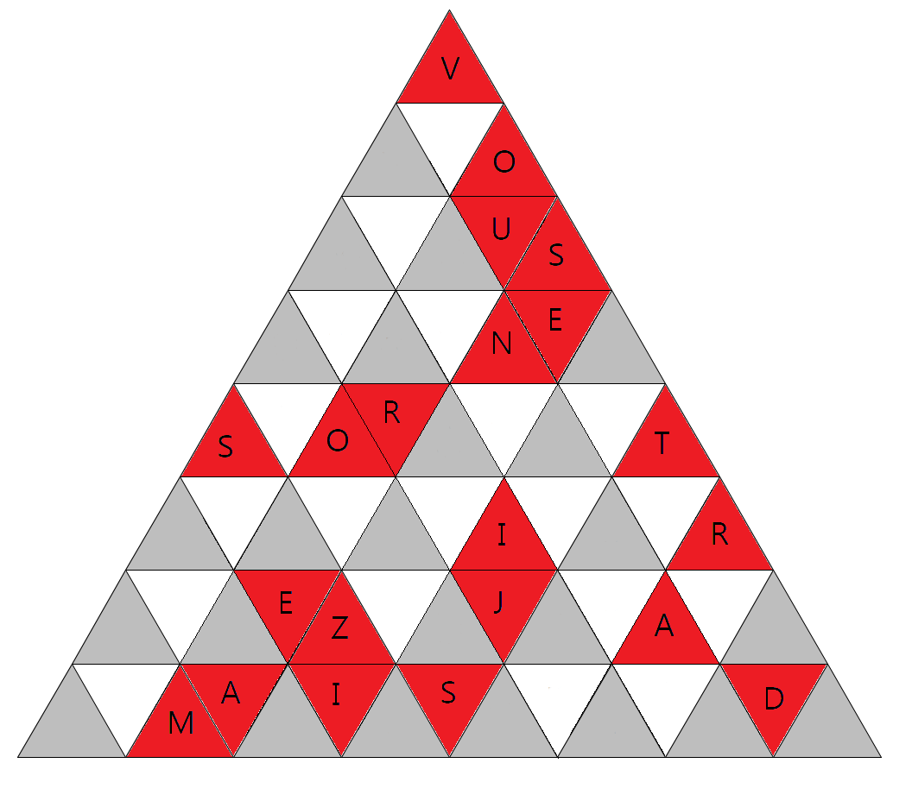
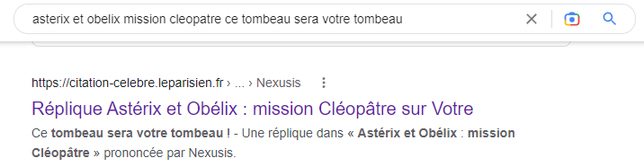


> **title:** Pyramide
>
> **category:** Steganography
>
> **difficulty:** Moyen
>
> **point:** 50
>
> **author:** Marie-Jeanne
>
> **description:**
>
> Il faut parfois extraire la clef pour trouver la solution.  
>
> Retrouvez ici une citation d'un personnage de film. Le flag est son nom.
>
> Format de flag : CYBN{Auteur}
>
> 

## Solution

En utilisant un outil comme **Binwalk** ou **Foremost**, nous pouvons trouver une archive **zip** cachée à l'intérieur de l'image et contenant un fichier nommé **chall_triforce_2.png**.

Ici j'ai utilisé **[AperiSolve](https://www.aperisolve.com/)** qui permet de lancer tout un tas d'outils et de tests sur des fichiers images.

Voici l'image récupérée dans le zip :

En ne gardant uniquement que les lettres correspondantes aux triangles rouges :

En suivant les lignes du triangle de haut en bas et de gauche à droite on peut y lire : **VOUS NE SORTIREZ JAMAIS D**.

Avec quelques recherches sur internet, on voit que la citation complète est **"Vous ne sortirez jamais d'ici, étrangers ! Ce tombeau sera votre tombeau"** et est tiré d'Astérix et Obélix mission Cléopâtre.

Il y avait une difficulté : l'oeuvre existe en bande dessinée et en film (1968). Dans ces deux-ci c'est **Tournevis** qui prononce la citation. Mais ici nous parlons du film d'Alain Chabat de 2002 où c'est **Nexusis** qui la prononce.

**`FLAG : CYBN{Nexusis}`**


