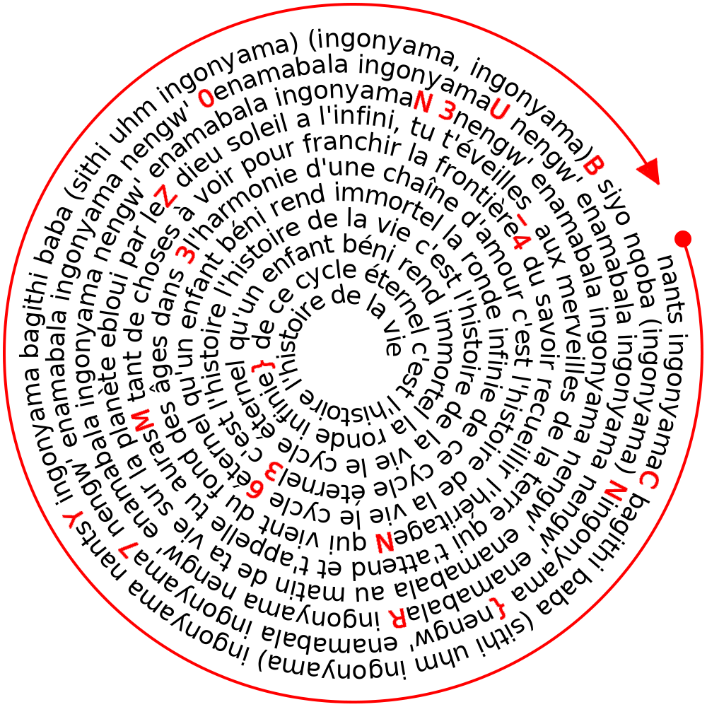


> **title:** Spirale
>
> **category:** Steganography
>
> **difficulty:** Facile
>
> **point:** 25
>
> **author:** Marie-Jeanne
>
> **description:**
>
> `tourne tourne petit moulin frappe frappe petite main`
>
> 

## Solution

Il faut lire tous les chiffres, majuscules, accolades et underscores dans le sens des aiguilles d'une montre.

**`FLAG : CYBN{70URN3Z_M4N363}`**


