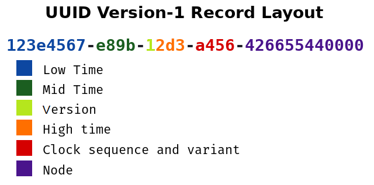


> **title:** Roombaverse - Ah bah c'est du propre
>
> **category:** Web
>
> **difficulty:** Très difficile
>
> **point:** 200
>
> **author:** MrSheepSheep
>
> **description:**
>
> Volez le compte Admin.
>
> https://roombaverse.cybernight-c.tf/

## Solution

On nous demande de voler le compte admin, sur l'onglet **Communauté** on peut voir un message concernant l'inscription de celui-ci. En regardant la source HTML on voit quelque chose d'étrange : **`data-uuidtime="138902489469351933"`**.


Cet attribut se retrouve également sur la page de notre compte, ici **`data-uuidtime="138902602591519150"`** :


On peut également voir que notre cookie servant d'authentification est un uuid, ici **`5dd841ae-7b2e-11ed-887d-02420a000708`**.
On devine rapidement le rapport entre ce **uuid** et l'attribut **data-uuidtime** :


En cherchant un peu sur le web les vulnerabilités concernant les uuid, on découvre que la version 1 des uuid est vulnérable. Ils sont générés à partir d'un timestamp et de l'adresse MAC de la machine :



Autrement dit comme on connaît le timestamp de l'administrateur grâce à data-uuidtime et que l'on connaît la fin du uuid grâce à notre propre compte, **on peut forger celui de l'administrateur**.

Pour faire cela on va dabord générer un uuid v1 grâce à Python en modifiant la fonction de la lib uuid.
Pour ça je copie colle dans un autre fichier entièrement le fichier de la lib, voici les modification dans la fonction **uuid1()** :


On génère ensuite notre uuid :

```python
print(uuid1())

# 073cf7fd-7b14-11ed-7945-01d84137b4c7
```

On n'a plus qu'à remplacer les 2 dernières sections par celles de notre propre uuid d'authentification *(qui était `5dd841ae-7b2e-11ed-887d-02420a000708`)*.

Le uuid `073cf7fd-7b14-11ed-7945-01d84137b4c7` devient alors **`073cf7fd-7b14-11ed-887d-02420a000708`**. On change notre cookie auth et l'on va dans l'onglet **Mon compte** :


**`FLAG : CYBN{W0w_qu31l_4udace_d3rriere_t0n_cl4v1er}`**



