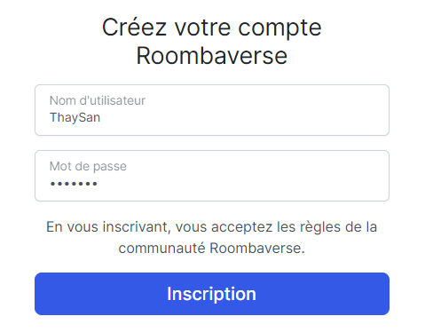
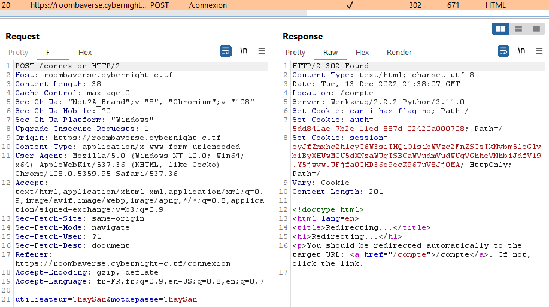
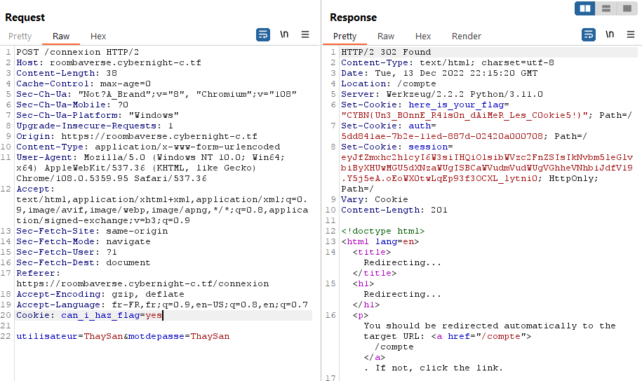


> **title:** Roombaverse - Cooking Roomba
>
> **category:** Web
>
> **difficulty:** Facile
>
> **point:** 25
>
> **author:** MrSheepSheep
>
> **description:**
>
> Aucune information.
>
> 
>
> https://roombaverse.cybernight-c.tf/

## Solution

Pour simplifier les démarches, tout est réalisé sur le navigateur intégré de Burp V2022.11.4 (le proxy est déjà paramétré dans celui-ci).

La première chose à faire est de créer un compte :

Une fois l'inscription terminée, nous pouvons nous connecter. Si l'on regarde la requête de connexion nous voyons qu'il s'agit d'un POST et la réponse contient le cookie **`can_i_haz_flag`** avec la valeur **`no`**.

On met la requête de connexion dans le repeater pour la renvoyer mais en avant cela on ajoute le cookie **`can_i_haz_flag=yes`**. Le serveur nous répond avec un nouveau cookie contenant le flag. 

**`FLAG : CYBN{Un3_B0nnE_R41s0n_dAiMeR_Les_C0okie5!}`**


