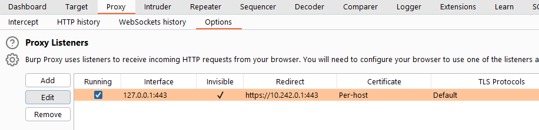
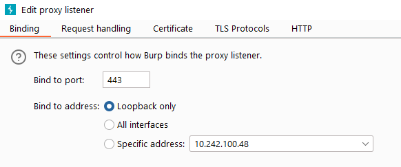
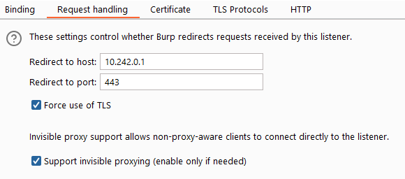
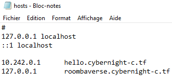
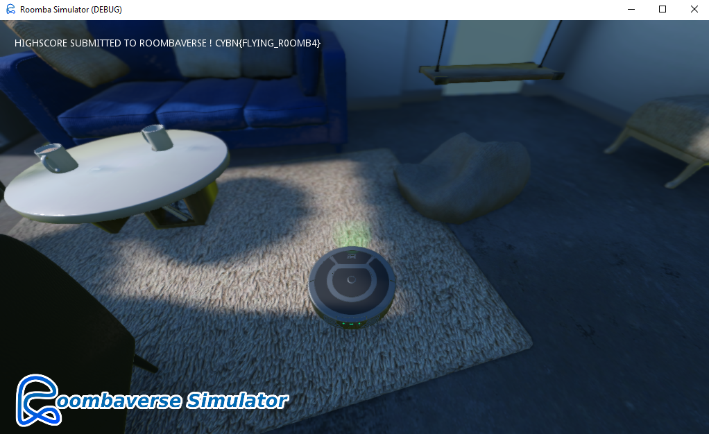
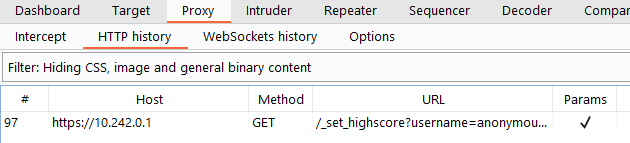
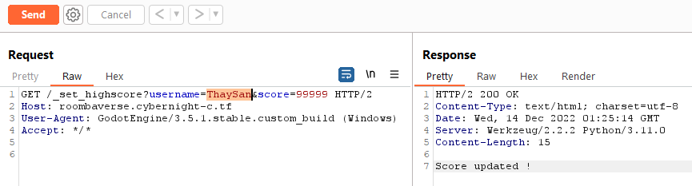
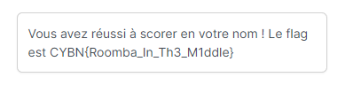


> **title:** Roombaverse - Leaderboard
>
> **category:** Web
>
> **difficulty:** Très difficile
>
> **point:** 200
>
> **author:** MrSheepSheep
>
> **description:**
>
> Soumettez un score Roombaverse Simulator avec votre propre compte
>
> Note : vous devez télécharger et jouer à Roombaverse Simulator pour ce challenge.
>
> https://roombaverse.cybernight-c.tf/roombaverse-simulator

## Solution

Pour réaliser ce challenge nous allons utiliser la fonction proxy de **Burp**. L'idée est de faire passer les requêtes du jeu fourni à travers le proxy pour les modifier avant leur émission. (Faire une attaque MITM en somme)

Voici la configuration à faire sur **Burp**, tout se passe dans les options de la partie **Proxy**.

Il faut paramétrer :

- Le port sur **`443`** (port HTTPS)
- L'interface sur **`Loopback only`**
- L'adresse redirection sur **`10.242.0.1`** (l'adresse du serveur)
- Le port redirection sur **`443`** (port HTTPS du serveur)
- **`Force use of TLS`** activé
- **`Support invisible proxying`** activé

Une fois cela fait, on vérifie que dans notre fichier **C:/Windows/System32/drivers/etc/host** on a bien mis l'adresse **127.0.0.1** pour toutes les requêtes qui partent sur **roombaverse.cybernight-c.tf**

Maintenant on peut lancer le jeu, le terminer (je renvoie au challenge **[Misc] Roombaverse Simulator - Roomba tricheur** pour savoir comment le terminer) et observer les requêtes passer :

Dans l'hitorique du proxy on peut voir une requête sur **`/_set_highscore`** :

On envoie la requête dans le reapeter de Burp (Clique droit sur la requête > Send to repeater) et l'on modifie les paramètres avec le nom de notre compte :

Il n'y a plus qu'à se rendre sur notre compte pour récupérer le flag :

**`FLAG : CYBN{Roomba_In_Th3_M1ddle}`**


