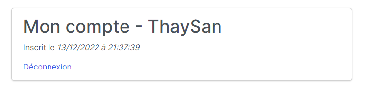
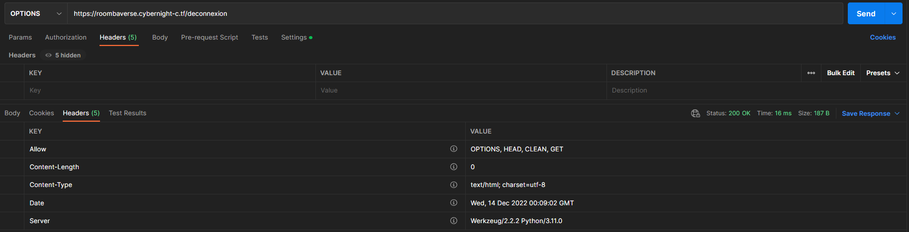
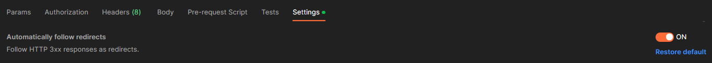
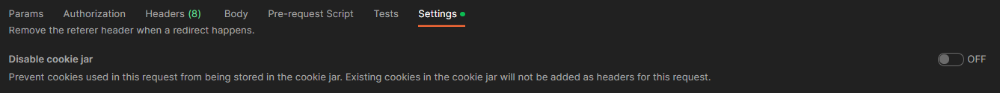
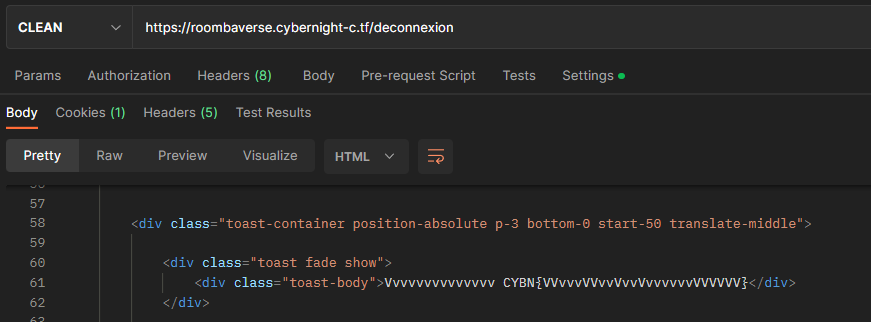


> **title:**  Roombaverse - vvvvvvvvvvvvvvvvvvvvvvvvvvvvvvvvvvvvv
>
> **category:** Web
>
> **difficulty:** Moyen
>
> **point:** 50
>
> **author:** MrSheepSheep
>
> **description:**
>
> vvvvvvvvvvvvvvvvvvvvvvvvvvvvvvvvvvvvv
>
> Vous avez essayé de vous déconnecter ?
>
> https://roombaverse.cybernight-c.tf/

## Solution

Comme dit dans la description du challenge, il faut étudier la déconnexion.

Le challenge se passe donc sur la route **/deconnexion** du site **`roombaverse.cybernight-c.tf`**.

En utilisant **PostMan** on peut faire une requête **OPTIONS** sur la route pour connaître les autres méthodes acceptées.

On peut voir dans les headers reçus que la méthode **CLEAN** est acceptée, ce n'est absolument pas une méthode standard. On peut alors la tester en l'écrivant manuellement dans PostMan.

**ATTENTION**, il faut impérativement les paramètres suivants dans PostMan pour gagner du temps (surtout éviter de faire d'autres étapes):

*`Automatically follow redirects`* est activée :

*`Disable cookie jar`* est désactivé :

Il ne reste plus qu'à faire la requête **CLEAN** et l'on recevra le flag dans un toast :

**`FLAG : CYBN{VVvvvVVvvVvvVvvvvvvVVVVVV}`**


