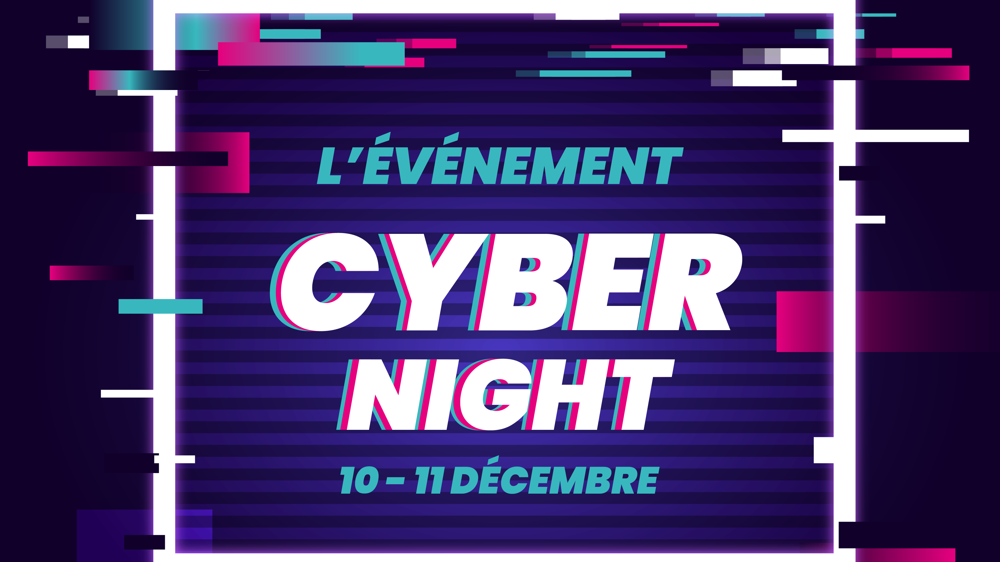

# EFREI-CyberNight 2022

Du 10 au 11 décembre, près de 200 étudiants de l’Efrei participeront à la CyberNight, un rendez-vous unique de la cybersécurité sur le campus.

Quel que soit le niveau académique ou la formation, la cyber s’adresse à tous les étudiants du numérique. Afin de sensibiliser tous les étudiants de l’école et de faire émerger les meilleurs talents en la matière, l’Efrei organise une CyberNight du samedi 10 décembre dès 14h jusqu’au dimanche 11 décembre à 9h du matin.

Au cours de cet événement marathon, les étudiants de l’école participeront à des challenges en cyber, assisteront à des conférences ou à des démos techniques et se formeront, en groupe, aux techniques de pentest (test d’intrusion). La CyberNight Efrei vise deux objectifs majeurs. En premier lieu, et dans la mesure où la cybersécurité est l’affaire de tous les professionnels du numérique, une telle opération permet de sensibiliser et de former aux bons réflexes cyber. Ensuite, les épreuves proposées permettront d’identifier les meilleurs étudiants cyber de l’école. Ils rejoindront l’équipe cyber étudiante de l’Efrei et participeront, durant une année entière, à des compétitions proposées par des organismes extérieurs à l’école (Le Hack, Le FIC,…).

## Cryptography
- {:.challenge.done} [Coupé-décalé](/writeups/CYBN_2022/Cryptography/Coup%C3%A9-d%C3%A9cal%C3%A9/)
- {:.challenge.done} [ExFILEtration](/writeups/CYBN_2022/Cryptography/ExFILEtration/)
- {:.challenge.done} [Il s'est baissé... ou pas](/writeups/CYBN_2022/Cryptography/Il%20s'est%20baiss%C3%A9%20ou%20pas/)
- {:.challenge.done} [J'ai pas ROTé](/writeups/CYBN_2022/Cryptography/J'ai%20pas%20ROT%C3%A9/)
- {:.challenge.done} [Les Allemands... Mais oui ! Les Allemands !](/writeups/CYBN_2022/Cryptography/Les%20Allemands%20Mais%20oui%20!%20%20%20Les%20Allemands%20!/)
- {:.challenge.done} [RSA Strong Prime Generator](/writeups/CYBN_2022/Cryptography/RSA%20Strong%20Prime%20Generator/)

## Forensics
- {:.challenge.done} [Bomberman 1/2](/writeups/CYBN_2022/Forensics/Bomberman%201_2/)
- {:.challenge.done} [Bomberman 2/2](/writeups/CYBN_2022/Forensics/Bomberman%202_2/)
- {:.challenge.done} [Magic](/writeups/CYBN_2022/Forensics/Magic/)
- {:.challenge.done} [Peu importe le chemin](/writeups/CYBN_2022/Forensics/Peu%20importe%20le%20chemin/)
- {:.challenge.done} [Sniff Sniff](/writeups/CYBN_2022/Forensics/Sniff%20Sniff/)
- {:.challenge.done} [Souvenir](/writeups/CYBN_2022/Forensics/Souvenir/)
- {:.challenge} [Thoses pesky sysadmins](/writeups/CYBN_2022/Forensics/thoses%20pesky%20sysadmins/)
- {:.challenge} [Vmdkk](/writeups/CYBN_2022/Forensics/Vmdkk/)
- {:.challenge.done} [Xray](/writeups/CYBN_2022/Forensics/Xray/)

## Hardware
- {:.challenge.done} [class4](/writeups/CYBN_2022/Hardware/class4/)
- {:.challenge.done} [Identify 1/3](/writeups/CYBN_2022/Hardware/Identify%201_3/)
- {:.challenge.done} [Find Me 2/3](/writeups/CYBN_2022/Hardware/Find%20Me%202_3/)
- {:.challenge.done} [Yo listen 3/3](/writeups/CYBN_2022/Hardware/Yo%20listen%203_3/)

## MISC
- {:.challenge.done} [Et je tombe tombe tombe ...](/writeups/CYBN_2022/Misc/Et%20je%20tombe%20tombe%20tombe/)
- {:.challenge.done} [riGOLe](/writeups/CYBN_2022/Misc/riGOLe/)
- {:.challenge.done} [Roombaverse Simulator - Des yeux partout](/writeups/CYBN_2022/Misc/Roombaverse%20Simulator%20-%20Des%20yeux%20partout/)
- {:.challenge.done} [Roombaverse Simulator - Roomba tricheur](/writeups/CYBN_2022/Misc/Roombaverse%20Simulator%20-%20Roomba%20tricheur/)
- {:.challenge.done} [Survey](/writeups/CYBN_2022/Misc/Survey/)
- {:.challenge.done} [Tinder](/writeups/CYBN_2022/Misc/Tinder/)

## OSINT
- {:.challenge} [A table](/writeups/CYBN_2022/Osint/A%20table/)
- {:.challenge} [Concerto](/writeups/CYBN_2022/Osint/Concerto/)
- {:.challenge} [Gimme_the_plant](/writeups/CYBN_2022/Osint/Gimme_the_plant/)
- {:.challenge} [J'aime les trains](/writeups/CYBN_2022/Osint/J'aime%20les%20trains/)
- {:.challenge} [La Banque](/writeups/CYBN_2022/Osint/La%20Banque/)
- {:.challenge} [Panneau](/writeups/CYBN_2022/Osint/Panneau/)
- {:.challenge} [Wisdom](/writeups/CYBN_2022/Osint/Wisdom/)

## Programmation
- {:.challenge} [Maze - Coward](/writeups/CYBN_2022/Programmation/Maze%20-%20Coward/)
- {:.challenge} [Maze - Greed](/writeups/CYBN_2022/Programmation/Maze%20-%20Greed/)
- {:.challenge} [Maze - Indiana Jones](/writeups/CYBN_2022/Programmation/Maze%20-%20Indiana%20Jones/)
- {:.challenge.done} [Repeat](/writeups/CYBN_2022/Programmation/Repeat/)
- {:.challenge.done} [Startup](/writeups/CYBN_2022/Programmation/Startup/)
- {:.challenge.done} [Timing](/writeups/CYBN_2022/Programmation/Timing/)

## pwn
- {:.challenge} [Functions madness](/writeups/CYBN_2022/pwn%20-%20Exploitation%20de%20binaires/Functions%20madness/)
- {:.challenge} [L'éternel](/writeups/CYBN_2022/pwn%20-%20Exploitation%20de%20binaires/L'%C3%A9ternel%20ret/)
- {:.challenge} [Mouais BOF](/writeups/CYBN_2022/pwn%20-%20Exploitation%20de%20binaires/Mouais%20BOF/)
- {:.challenge} [Turducken](/writeups/CYBN_2022/pwn%20-%20Exploitation%20de%20binaires/Turducken/)

## Reverse
- {:.challenge.done} [Auth 1](/writeups/CYBN_2022/Reverse/Auth%201/)
- {:.challenge.done} [Auth 2](/writeups/CYBN_2022/Reverse/Auth2/)
- {:.challenge.done} [Auth 3](/writeups/CYBN_2022/Reverse/Auth3/)
- {:.challenge} [I like to mov it mov it](/writeups/CYBN_2022/Reverse/I%20like%20to%20mov%20it%20mov%20it/)
- {:.challenge.done} [Roombaverse Simulator - Cryptoroomba](/writeups/CYBN_2022/Reverse/Roombaverse%20Simulator%20-%20Cryptoroomba/)
- {:.challenge} [Roomboom!](/writeups/CYBN_2022/Reverse/Roomboom!/)
- {:.challenge.done} [TENET](/writeups/CYBN_2022/Reverse/TENET/)

## Steganography
- {:.challenge.done} [50 Shades of Stephane Legar](/writeups/CYBN_2022/Steganography/50%20Shades%20of%20Stephane%20Legar/)
- {:.challenge.done} [Chess Master](/writeups/CYBN_2022/Steganography/Chess%20Master/)
- {:.challenge.done} [Deviens champion sers toi de tout ce que tu as appris](/writeups/CYBN_2022/Steganography/Deviens%20champion%20sers%20toi%20de%20tout%20ce%20que%20tu%20as%20appris/)
- {:.challenge.done} [Drifting in the bits](/writeups/CYBN_2022/Steganography/Drifting%20in%20the%20bits/)
- {:.challenge.done} [Pyramide](/writeups/CYBN_2022/Steganography/Pyramide/)
- {:.challenge.done} [Spirale](/writeups/CYBN_2022/Steganography/Spirale/)

## Web
- {:.challenge.done} [Roombaverse - Ah bah c'est du propre](/writeups/CYBN_2022/Web/Roombaverse%20-%20Ah%20bah%20c'est%20du%20propre/)
- {:.challenge.done} [Roombaverse - Cooking Roomba](/writeups/CYBN_2022/Web/Roombaverse%20-%20Cooking%20Roomba/)
- {:.challenge.done} [Roombaverse - Leaderboard](/writeups/CYBN_2022/Web/Roombaverse%20-%20Leaderboard/)
- {:.challenge} [Roombaverse - Live](/writeups/CYBN_2022/Web/Roombaverse%20-%20Live/)
- {:.challenge.done} [Roombaverse - vvvvvvvvvvvvvvvvvvvvvvvvvvvvvvvvvvvvv](/writeups/CYBN_2022/Web/Roombaverse%20-%20vvvvvvvvvvvvvvvvvvvvvvvvvvvvvvvvvvvvv/)
