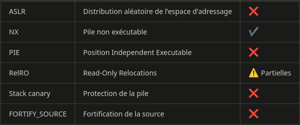


> **title:** Functions madness
>
> **category:** pwn - Exploitation de binaires
>
> **difficulty:** Très difficile
>
> **point:** 150
>
> **author:** *
>
> **description:**
>
> **Sujet**
>
> L'obfuscation c'est marrant mais ça ne protège pas contre les exploits. Vous n'aurez pas accès au code source pour ce challenge.
>
> **Informations de connexion**
>
> En étant connecté au VPN Wireguard :
>
> * *Protocole* : SSH
>
> * *Hôte* : 10.242.0.1
>
> * *Port* : 2227
>
> * *Utilisateur* : `ctf`
>
> * *Mot de passe* : `ctf`
>
> Si vous êtes sur GNU/Linux :
>
> ```
>
> ssh ctf@10.242.0.1 -p 2227
>
> ```
>
> **Environnement système & compilation**
>
> 
>
> **Le chemin `/tmp` est writable.** 
>
> Sur la VM sont installés les programmes suivants :
>
> *  python3 (**ATTENTION !** Bien utiliser la commande `python3` et pas juste `python`)
>
> *  perl
>
> *  gcc
>
> *  gdb (avec l'extension pwn-dbg)
>
> *  radare2
>
> 

## Coming Soon...


