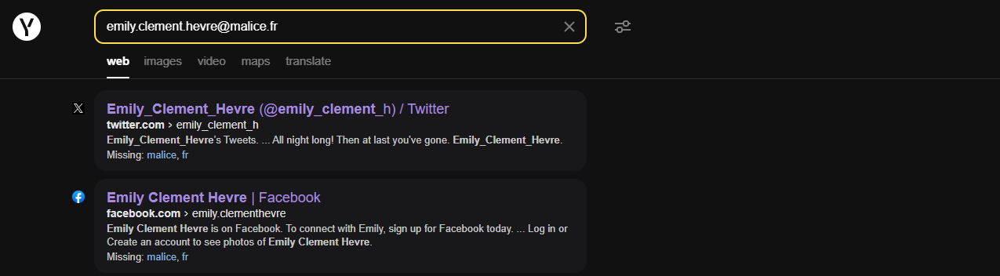

<!--  -->

	titre:
	Invest Now !

	categorie:
	OSINT

	difficulté:
	Moyen

	points:
	100

	description:
	

		InvestNow! est une application de gestion de wallet Bitcoin : elle permet d'acheter et d'échanger des Bitcoins à tout moment pour spéculer sur la montée des cours. De nombreuses personnes sont devenues riches grâce à ce site!
	

	

		Vous avez réussi à développer un script pour détecter si une adresse mail est inscrite sur ce site. Après quelques heures de tests avec des bases de données trouvées sur le darknet, une première adresse mail est ressortie : emily.clement.hevre@malice.fr.
	

	

		Volez la clé privée du compte de Emily Clément Hevré, il y a peut-être des milliers d'euros à la clé !
	

	

		Le flag sera à soumettre sous la forme MALICE{clé}
	

 

	connection:
	<a href="http://investnow3.chall.malicecyber.com/">http://investnow3.chall.malicecyber.com/</a>

 

## Solution

Direction **[Yandex](https://yandex.com/search/?text=emily.clement.hevre%40malice.fr)** pour chercher cet email :

On tombe sur un compte **[Twitter](https://twitter.com/emily_clement_h)**, sur lequel on va trouver sa chanson préférée : **All Night** de Parov Stellar

Sur le compte **[Facebook](https://www.facebook.com/emily.clementhevre/about_overview)** sorti également par Yandex, on trouve son lycée, qui est surement situé dans sa ville de naissance :

Il ne nous manque plus qu'un **[Instagram](https://www.instagram.com/emilyclementhevre/)** pour obtenir le trio magique, et effectivement en cherchant son nom complet dessus on trouve son compte ainsi qu'un animal totem :

On peut maintenant répondre aux questions de sécurité pour récupérer son compte :

On a maintenant accès à son wallet crypto et donc au flag :

`FLAG : MALICE{5JWVBcrWBS2F98nRai8BjDKt8EBQ8Jm9CtMEQD1xkpGNwqFFGgX}`

<!--  -->
