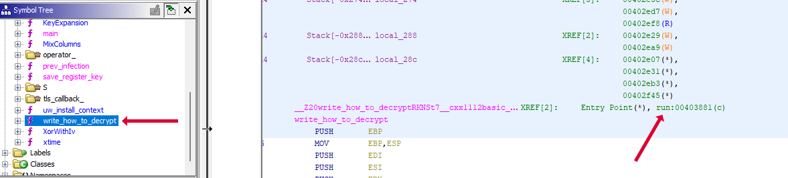
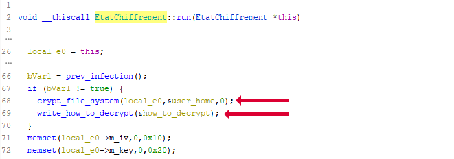
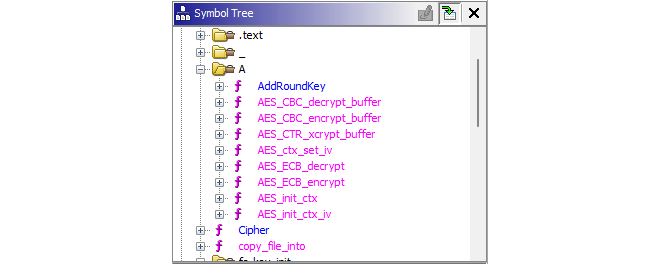
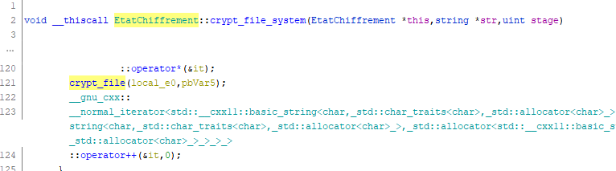
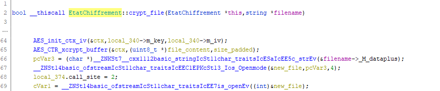
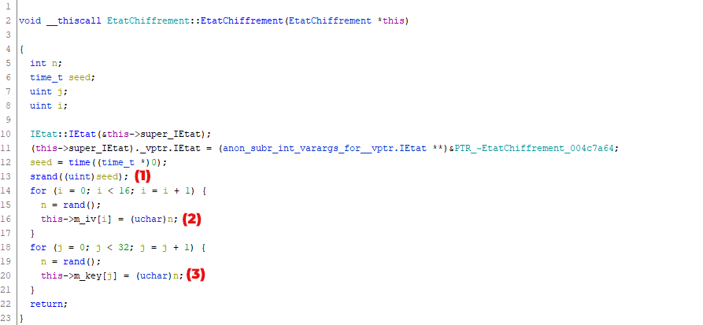
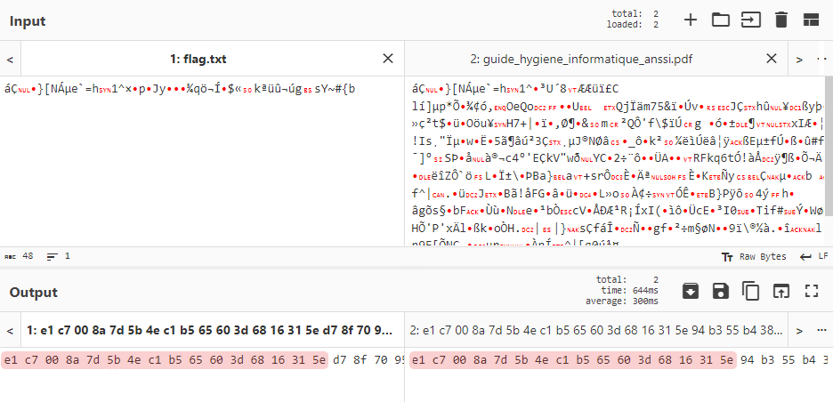
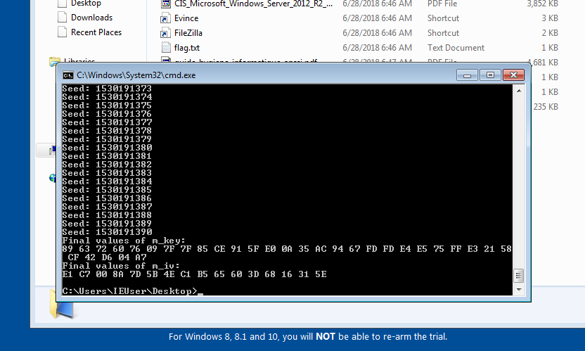
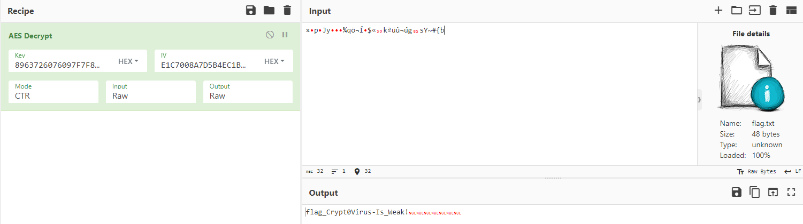

<!--  -->

<div class="info">
<p class="title">
	<span class="name">titre:</span>
	CryptoVirus
</p>
<p class="category">
	<span class="name">categorie:</span>
	Reverse
</p>
<p class="difficulty">
	<span class="name">difficulté:</span>
	Difficile
</p>
<p class="points">
	<span class="name">points:</span>
	150
</p>
<p class="description">
	<span class="name">description:</span>
Cette machine a été cryptolockée, des données vitales pour l'entreprise sont inaccessibles.
</br>
L'attaquant réclame 0,5 BTC.
</br>
Déchiffrez le fichier flag.txt sur le bureau.
</br>
Le flag sera à soumettre sous la forme MALICE{flag}
</p>
</div>

## Solution

**Le fichier svchost.exe est un ransomware, ne pas le lancer sur votre machine**.

Une fois connecté à la machine infectée, on trouvait plusieurs fichiers chiffrés sur le bureau, dont **`flag.txt`**.

Dans le dossier **Public** on y trouvait le ransomware : **`svchost.exe`**.

Ici j'utilise **[Ghidra](https://ghidra-sre.org)** pour décompiler le binaire.

### Premier pas dans le binaire

Une fois l'analyse automatique terminée, on trouve la fonction **`write_how_to_decrypt`**. En regardant les références de celle-ci, on tombe sur la fonction **`run`** qui est le point d'entrée du chiffrement et surtout qui appartient à la classe **`EtatChiffrement`**.



Dans cette nouvelle fonction, on y trouve **`crypt_file_system`**. On voit également les attributs **`m_iv`** et **`m_key`** de la variable **`local_e0`** et qui correspond à **`this`**.



Sachant que dans les fonctions découvertes par Ghidra on y trouve plusieurs nommées **AES**, on a un *léger* indice du chiffrement utilisé.



Retournons un peu sur la fonction **`crypt_file_system`**. On voit qu'elle appartient également à la classe **`EtatChiffrement`**.

Plus loin, un appel à **`crypt_file`** est fait.



Continuons à descendre en explorant la fonction **`crypt_file`**. Elle appelle les fonction **`AES_init_ctx_iv`** avec **`m_key`** et **`m_iv`** puis appelle **`AES_CTR_xcrypt_buffer`** sur **`file_content`**.



A partir de là, pas besoin de s'enfoncer plus, on sait que le malware chiffre les fichier en AES CTR. Il nous faut maintenant trouver **`m_key`** et **`m_iv`**.

Pour cela on va regarder le constructeur de la classe **`EtatChiffrement`**.



Après avoir renommé 2-3 variables, on en déduit que :

(1) Une seed est utilisée pour pour générer les randoms ensuite, cette seed est **`time(0)`**, c'est à dire l'heure actuelle (c'est un timestamp)

(2) On génère l'IV avec 16 bytes aléatoires

(3) On génère la clé avec 32 bytes aléatoires 

### Obtention de l'IV

Bon, maintenant qu'on sait ça il faut trouver l'IV et la clé. Pour ça on les différents fichiers chiffrés sur le bureaux. Si l'on regarde le début de ceux-ci, on voit que les 16 premiers bytes sont toujours les mêmes, autrement dit c'est l'IV utilisé. On le devine soit parce qu'on sait que c'est une pratique courante lors de chiffrement, soit en étudiant un peu plus le binaire pour le voir.



L'IV' : **`E1C7008A7D5B4EC1B565603D6816315E`**

### Obtention de la clé

On a l'IV mais comment obtenir la clé ?

**Avec un bon vieux bruteforce.**

On connaît environ l'heure de chiffrement des fichiers avec leur dernière heure modifications. On va donc, pour chaque seconde à partir de ce temps, générer des 16 randoms et regarder quand est-ce qu'on obtient les mêmes valeurs que l'IV que l'on vient de trouver. Cela voudra dire que l'on a trouvé la seed utilisée et que l'on pourra regénérer la clé !

Malheureusement on ne peut pas lancer ce bruteforce n'importe comment, il faut se placer dans les mêmes conditions que le malware. On va donc écrire un bout de C++ (*avec ChatGPT pour les plus flemmards*) et on le compilera en 32bits pour windows et ainsi le lancer sur la machine infectée.

```c++
#include <iostream>
#include <ctime>
#include <cstdlib>
#include <vector>
#include <algorithm>


int main() {
    std::vector<uint8_t> targetIV = {0xE1, 0xC7, 0x00, 0x8A, 0x7D, 0x5B, 0x4E, 0xC1, 0xB5, 0x65, 0x60, 0x3D, 0x68, 0x16, 0x31, 0x5E};

    for (uint32_t seed = 1530191380; seed <= UINT32_MAX; ++seed) {
        std::cout << "Seed: " << seed << std::endl;
        
        std::srand(seed);
        
        std::vector<uint8_t> m_iv;
        for (int i = 0; i < 16; ++i) {
            int random_byte = rand() % 256;
            m_iv.push_back(static_cast<uint8_t>(random_byte));
        }
    
        if (m_iv == targetIV) {
            
            std::vector<uint8_t> m_key;
            for (int i = 0; i < 32; ++i) {
                int random_byte = rand() % 256;
                m_key.push_back(static_cast<uint8_t>(random_byte));
            }
            
            std::cout << "Final values of m_key ";
            for (int i = 0; i < 32; i++) std::cout << m_key.at(i) << ' ';
            std::cout << std::endl;
            
            std::cout << "Final values of m_iv ";
            for (int i = 0; i < 16; i++) std::cout << m_iv.at(i) << ' ';
            std::cout << std::endl;
            
            break;
        }
    }

    return 0;
}
```

Après compilation avec **[MinGW](https://www.mingw-w64.org)**, on transfert l'exécutable sur la machine infectée et on le lance :



La clé : **`8963726076097F7F85CE915FE00A35AC9467FDFDE4E575FFE32158CF42D604A7`**

### Déchiffrement

On a l'IV, on la clé, on a le fichier chiffré, direction **[CyberChef](https://gchq.github.io/CyberChef/#recipe=AES_Decrypt(%7B'option':'Hex','string':'8963726076097F7F85CE915FE00A35AC9467FDFDE4E575FFE32158CF42D604A7'%7D,%7B'option':'Hex','string':'E1C7008A7D5B4EC1B565603D6816315E'%7D,'CTR','Raw','Raw',%7B'option':'Hex','string':''%7D,%7B'option':'Hex','string':''%7D)&input=149wlUp5mouBvnH2rM2VJKsOa6r8%2B6z6ZwhzWX4je2I)**.

On se souvient, il faut mettre AES en mode CTR et retirer les 16 premiers bytes du fichiers (qui correspondent à l'IV).



<span class="flag">`FLAG : MALICE{flag_Crypt0Virus-Is_Weak!}`</span>

<!--  -->
