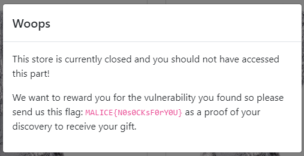

<!--  -->

<div class="info">
<p class="title">
	<span class="name">titre:</span>
	WebChaussettes
</p>
<p class="category">
	<span class="name">categorie:</span>
	Reverse
</p>
<p class="difficulty">
	<span class="name">difficulté:</span>
	Moyen
</p>
<p class="points">
	<span class="name">points:</span>
	100
</p>
<p class="description">
	<span class="name">description:</span>
	Venez essayer nos chaussettes révolutionnaires !
</p> 
<p class="connection">
	<span class="name">connection:</span>
	<a href="http://webchaussettes3.chall.malicecyber.com/">http://webchaussettes3.chall.malicecyber.com/</a>
</p> 
</div>

## Solution

Dans ce challenge il fallait reverse le JavaScript pour calculer le code d'accès côté client. Il est composé de 4 parties :


### Contrer le debugger

Seulement si l'on ouvre les outils de développement du navigateur, l'exécution se met en pause à cause d'un **Interval** qui lance le mode debug.


Pour contrer cela, on va simplement rafraîchir la page et exécuter tout de suite dans la console le code :

```JS
setInterval = () => {}
```

Cela permet d'empêcher l'appel à **`setInterval`** et donc de placer la debugger.

### Trouver la fonction d'évaluation

Il n'y a pas de boutons pour envoyer son code et certains **`input`** sont désactivés, on va donc les analyser un peu. Parmi les évènements écoutés, on y trouve **`keyup`** qui appelle une fonction dans **`bundle.js`**


On voit tout de suite que la fonction **`execEvalFunc`** est appelée, puis que celle-ci évalue une string et l'appelle. On va donc mettre un breakpoint dessus.


En entrant n'importe quoi dans l'input, on déclenche le breakpoint et l'on peut rentrer dans la fonction évaluée :


On voit que la fonction de validation est décodée de la base64 puis evaluée (*et nommée handler*) avant d'être appelée. Il faut alors continuer jusqu'à son appel et rentrer dedans :


### Code n°1

Nous avons maintenant accès à la fonction qui vérifie le code n°1, on peut commencer à la déobfusquer.

Pour tout ce qui est des appels du type : **`_0x2d45('0x24')`**, pour connaître leur valeur il suffit de les exécuter dans la console puisque nous avons mis l'exécution en pause et que nous sommes dans le même contexte.


(1) Lorsqu'on a appelé **`handler`**, on a vu que les paramètres passés étaient : **`notre code`**, **`le numéro de la partie du code (ici 0)`**, **`le context`**.

(2) Vérification que notre code :
- ne soit pas null ou vide
- sa longueur fasse 10
- la fonction _0x50f289 retourne true

(3) La fonction _0x50f289 prend notre code en argument, le if à la ligne suivante est toujours vrai et le retour est un test Regex pour savoir si notre code ne contient bien que des caractères de l'hexadécimal. La fonction vérifie que notre code est sous format hexadécimal.

(4) le if est toujours faux, donc retourne toujours `![]`, soit false. Il ne faut donc surtout pas rentrer dans le if (2).

(5 & 6) if toujours vrai

Cela nous donne, une fois renommé et mis en forme :

```js
window.checkFunc = function initialCheckFunc(code, partNumber, context) {
    function isHexa(code) {
        return /^[\x00-\x7F]*$/.test(code)
    }

    if (!code || code.length !== 10 || !isHexa(code)) return false

    function fromHex(code) {
        let result = ''
        for (let i = 0; i < code.length && code.substr(i, 2) !== '00'; i += 2) {
            result += String.fromCharCode(parseInt(code.substr(i, 2), 16))
        }
        return result
    }

    const decoded = fromHex(code)
    return context.users.some(user => user.id === decoded.toLowerCase())
}
```

Il faut donc que notre code soit simplement l'id de l'utilisateur en hexadécimal.

**L'id se trouve dans le contexte transmis, on va donc créer un compte est regarder son id**

### Code n°2

Une fois le code 1 réussi, on a la même méthode pour récupérer les fonctions de vérification des codes suivants. On réutilise nos mêmes breakpoints.

Une fois la fonction reverse comme avant, on obtient :

```js
window.checkFunc = function secondCheckFunc(code, partNumber, context) {
    if (!context.user || code.length !== 5) return false
	
    const toBase64 = str => Buffer.from(str).toString('base64')
    return code.toLowerCase() === toBase64(context.user.firstname.padEnd(5, 'P')).slice(0, 5).toLowerCase()
}
```

Il faut donc que notre code soit les 5 premiers caractères de la base64 des 5 premiers caractères de notre firstname (pad avec des "P" si trop petit).

### Code n°3

Une fois la fonction reverse, on obtient :

```js
window.checkFunc = function thirdCheckFunc(code, partNumber, context) {
    if (!context.user || code.length !== 5) return false

    function toHex(str) {
        return unescape(encodeURIComponent(str)).split('').map(function (c) {
            return c.charCodeAt(0).toString(16)
        }).join('')
    }
    
    return code.toLowerCase() === toHex(context.user.lastname.padEnd(5, 'P')).slice(0, 5).toLowerCase()
}
```

Il faut donc que notre code soit l'hexadécimal des 5 première lettres de notre lastname (pad avec des "P" si trop petit).

### Code n°4

Une fois la fonction reverse, on obtient :

```js
window.checkFunc = function fourthCheckFunc(code, partNumber, context) {
    if (!context.serialParts || context.serialParts.length !== 3 || code.length !== 0x5) return false
    const toBase64 = str => Buffer.from(str).toString('base64')
    return code.toLowerCase() === toBase64(context.serialParts.map(part => part.toLowerCase()).reverse().join('')).slice(0, 5).toLowerCase()
}
```

Il faut donc que notre code soit les 5 premiers caractères de la base64 en minuscule de nos 3 précédents codes concaténés dans l'ordre inverse (*oof*).

### Keygen

```js
const toHex = (s) => Buffer.from(s).toString('hex')
const toBase64 = (s) => Buffer.from(s).toString('base64')

const genPart1 = (user) => toHex(user.id)
const genPart2 = (user) => toBase64(user.firstname.padEnd(5, 'P')).slice(0, 5).toLowerCase()
const genPart3 = (user) => toHex(user.lastname.padEnd(5, 'P')).slice(0, 5).toLowerCase()
const genPart4 = (codes) => toBase64(codes.map(c=>c).reverse().join('').toLowerCase()).slice(0, 5).toLowerCase()

function keygen(user) {
	const codes = []
	codes.push(genPart1(user))
	codes.push(genPart2(user))
	codes.push(genPart3(user))
	codes.push(genPart4(codes))
	return codes.join('-')
}

const user = {
	"username": "ThaySan",
	"email": "mail@mail.com",
	"firstname": "Thay",
	"lastname": "San",
	"id": "ecfov"
}

console.log(keygen(user))
```



<span class="flag">`FLAG : MALICE{N0s0CKsF0rY0U}`</span>

<!--  -->
