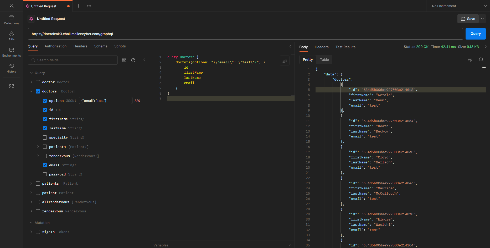

<!--  -->

<div class="info">
<p class="title">
	<span class="name">titre:</span>
	DoctoLeak
</p>
<p class="category">
	<span class="name">categorie:</span>
	Web
</p>
<p class="difficulty">
	<span class="name">difficulté:</span>
	Moyen
</p>
<p class="points">
	<span class="name">points:</span>
	100
</p>
<p class="description">
	<span class="name">description:</span>
Je dois trouver le numéro de sécurité sociale du Patient 0 !
</br>
C'est une question de vie ou de mort...
</p> 
<p class="connection">
	<span class="name">connection:</span>
	<a href="http://doctoleak3.chall.malicecyber.com/">http://doctoleak3.chall.malicecyber.com/</a>
</p> 
</div>

## Solution

En se rendant tout en bas du site, on trouve un lien vers une api **GraphQL**.


Pour exploiter cette API, j'utilise ici **[Postman](https://postman.com)** et sa fonctionnalité GraphQL.


En copiant collant le lien de l'API dans le champ d'URL de Postman, la récupération du schéma est faite automatiquement et l'on trouve les différentes **query** et **mutations** disponibles.


On ne peux évidemment pas simplement lister les patients pour trouver notre **Patient 0**. Si l'on essaie toutes les query et mutations :

- doctor : email nécessaire (nous n'en connaissons pas)
- doctors : fonctionne !
- patients : authentification nécessaire
- patient : id nécessaire (nous n'en connaissons pas)
- allrendezvous : authentification nécessaire
- rendezvous : id nécessaire (nous n'en connaissons pas)
- signIn : login / mot de passe nécessaire (nous n'en connaissons pas)

On est donc très limité pour explorer. La seule query utilisable est **`doctors`**, qui sert à lister les docteurs.


Puisque **`options`** attend un JSON, commençons par en mettre un vide, on récupère alors la liste des docteurs **mais on ne peut pas récupérer leurs mails ou leur mot de passe**, une erreur apparaît s'il on essaie.

L'erreur en question est : `Cannot return null for non-nullable field Doctor.email`. Cela signifie qu'il y a probablement un filtre empêchant de renvoyer les mails, leur valeur est alors définie à **`null`** et comme cela ne correspond pas au schéma attendu, GraphQL génère une erreur.

On peut aussi lister leurs patients mais ceux-ci sont toujours **`null`**, cependant comme dans le schéma ce champ est nullable, aucune erreur n'est générée.

En essayant de jouer avec **`options`**, on peut voir que si l'on met **`{"email": "test"}`**, on pourra cette fois-ci lister tous les docteurs avec leur mails, mais ceux-ci auront la valeur **`"test"`**. On vient de définir une valeur par défaut. C'est ce qu'on appelle de la projection.



En tentant quelques modifications, on peut essayer **`{"email": true}`** (*ou `{"email": 1}`, cela fonctionne aussi*), pour une raison assez obscure, cette projection va bypasser le filtre et récupérer la vraie valeur du champ :


On peut alors récupérer les mails et mot de passe des docteurs, se connecter à leur place et lister les patients.

Ou alors simplement lister directement tous leurs patients avec la même technique et chercher le **Patient 0** à l'intérieur, l'options est alors :

```
{
  "patients": {
    "ssn": 1,
    "firstName": 1,
    "lastName": 1
  }
}
```


Tout en bas on trouve notre **Patient 0** et son numéro de sécurité sociale.

<span class="flag">`FLAG : b16cff8b-4a5a-41c8-8545-d9880fd7aae5`</span>

<!--  -->
