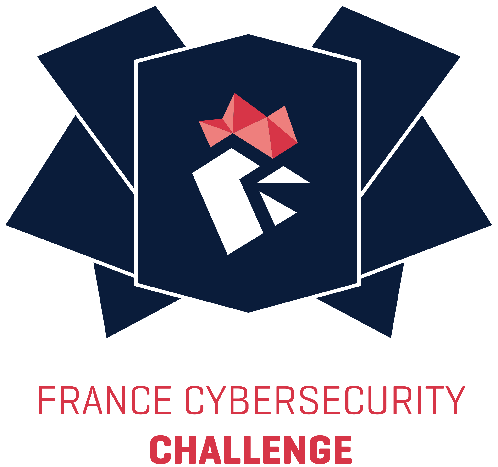

# FCSC 2023

Du 21 au 30 avril 2023, participez au France Cybersecurity Challenge (FCSC) pour gagner votre place au sein de l'équipe France qui défendra les couleurs nationales lors du European Cybersecurity Challenge (ECSC) organisé à Hamar (Norvège) du 24 au 27 octobre 2023.

Le FCSC est un CTF de type "jeopardy", avec cette année une soixantaine d'épreuves de difficultés variées dans les catégories suivantes : crypto, reverse, pwn, web, forensics, hardware, attaque par canaux auxiliaires ou en faute et misc.

Retrouvez toutes les infos sur le site de l'ANSSI.

## Teasing
- [Challenge de teasing](./teasing/)

## Cryptographie

## Hardware

## Misc

## Reverse

## Stéganographie

## Web
