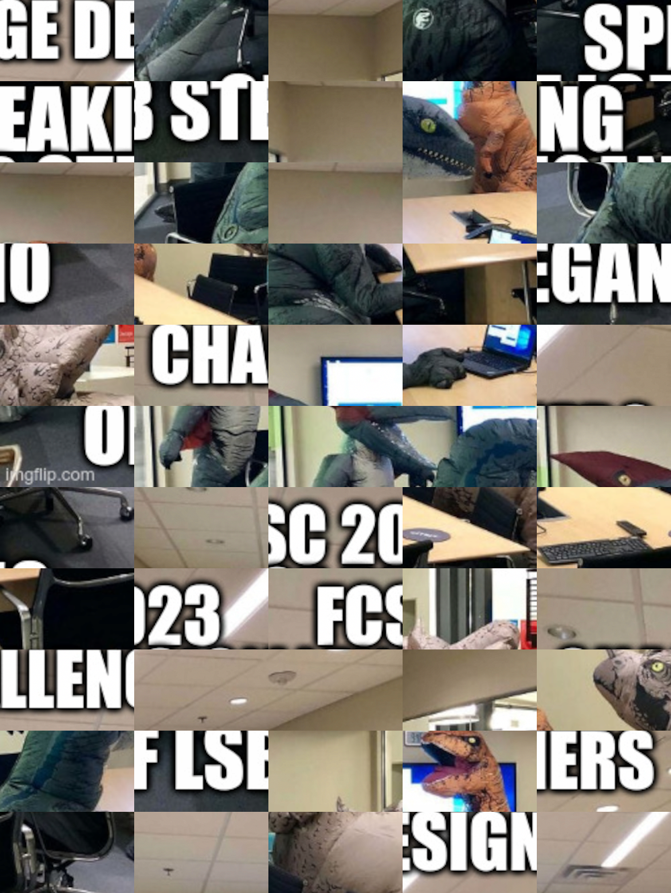
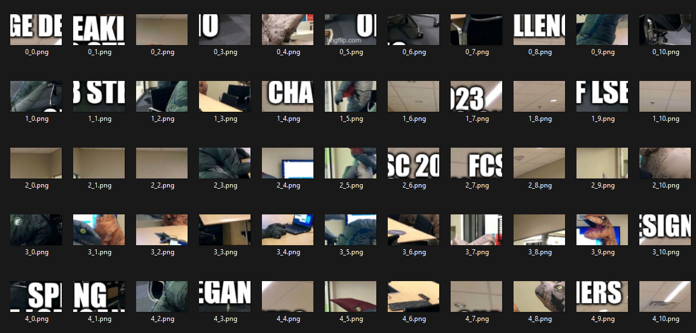
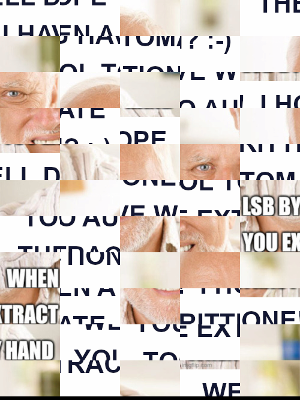
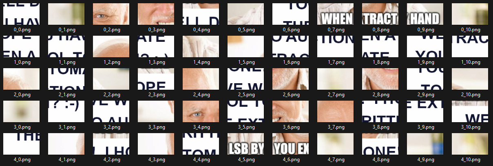
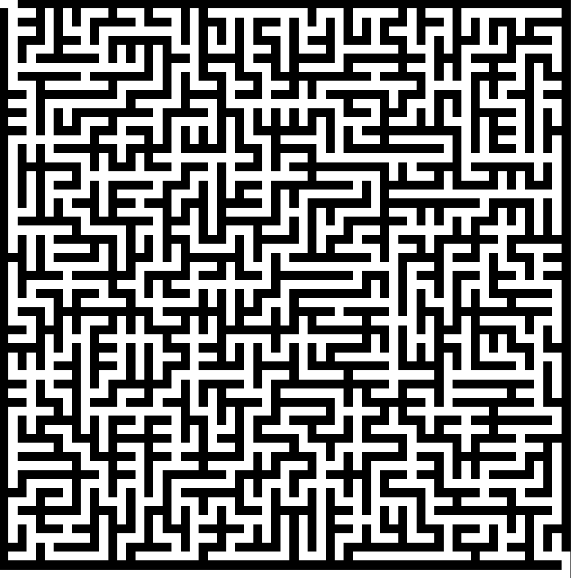
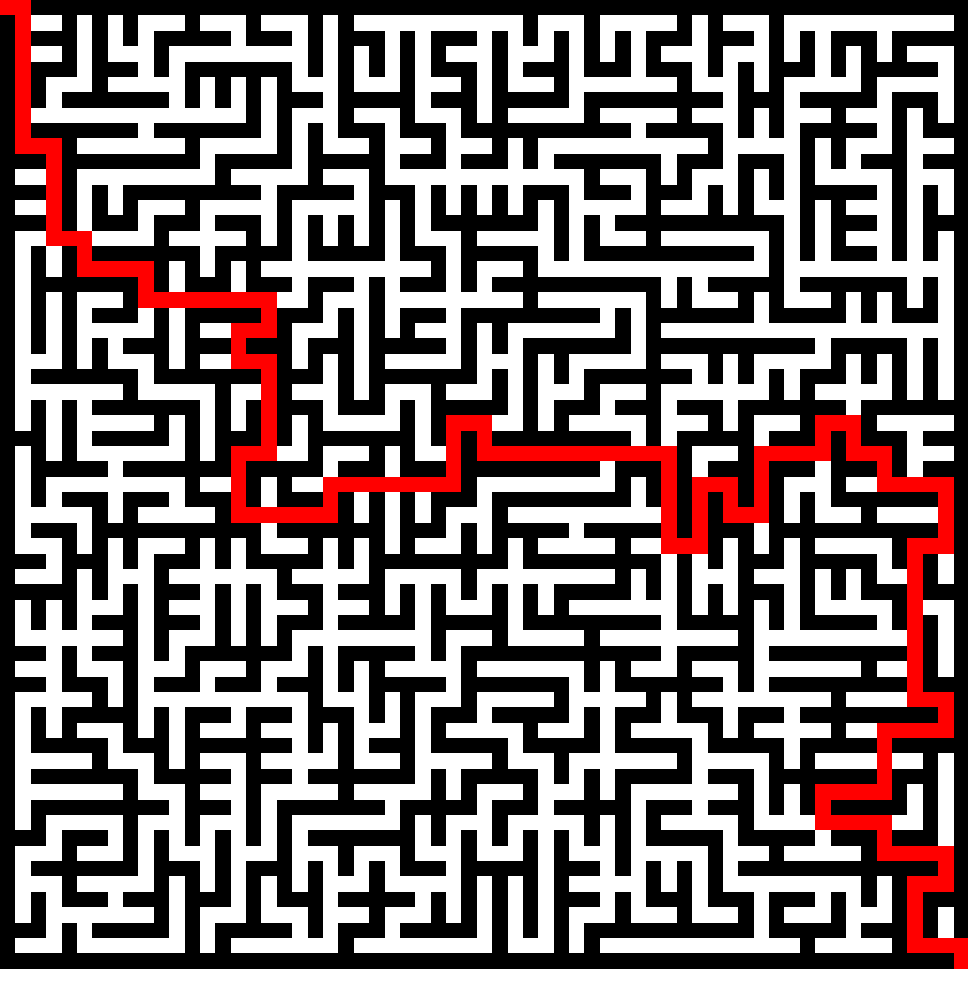


> **title:** Teasing
>
> **difficulty:** -
>
> **point:** 1
>
> **author:** FCSC
>
> **description:**
>
> Pour vous faire patienter jusqu'au 21 avril 2023 à 14h pour le lancement du FCSC 2023, nous vous proposons cette année encore une épreuve de teasing !
>
> Le point de départ est l'image donnée ci-dessous et vous permettra d'aboutir à un flag au format FCSC{xxx}.
>
> La résolution de ce challenge apportera 1 point symbolique pour le FCSC 2023, et sera matérialisée sur le site par un 🔥 à côté des noms d'utilisateur.
>
> 

## Solution

Une image est fournie :




### Niveau 1

#### Réarranger l'image

Il faut commencer par la remettre dans le bon sens, pour ma part je suis parti sur un **script Python** pour découper les parties puis direction **Photoshop** pour réassembler.

Pour découper les parties :

```python
from PIL import Image
import os

# nom du PNG
name = "teaser"
# nombre de parties horizontales et verticales
hpart = 5
vpart = 11

# Ouvre l'image
img = Image.open(f"{name}.png")
# Détermine la largeur et hauteur d'une partie
w, h = (img.width // hpart, img.height // vpart)

# Créer le dossier où stocker les parties extraites
if not os.path.isdir(f"./{name}_parts"):
	os.mkdir(f"./{name}_parts")

for y in range(vpart):
	for x in range(hpart):
		# Créer une image de la taille d'une partie
		img_part = Image.new('RGB', (w, h), 'red')
		# Copie la partie de l'image d'origine
		copy = img.crop((x*w, y*h, x*w+w, y*h+h))
		# Colle cette copie dans la nouvelle image
		img_part.paste(copy)
		# Sauvegarde la nouvelle image
		img_part.save(f"./{name}_parts/{x}_{y}.png")
```

On ressort avec un dossier comme ça :



Avec Photoshop on remet ça facilement dans l'ordre, ce qui donne :


#### LSB

Maintenant on suit ce qui est dit sur l'image, on récupère les LSB pour voir ce qui s'y cache :

```python
from PIL import Image

# Nombre de bits à récupérer
n = 1
# Bits que nous allons récupérer
binary = ""
# Image réarrangée
img = Image.open(f"./teaser_ordered.png")

for y in range(img.height):
	for x in range(img.width):
		# Lecture en binaire de chaque canaux de chaque pixel
		r, g, b = [bin(i)[2:].zfill(8) for i in img.getpixel((x, y))]
		# Récupération des derniers n bits
		binary += r[-n:] + g[-n:] + b[-n:]

# Regroupement des bits 8 par 8
data = bytes([int(binary[i:i+8], 2) for i in range(0, len(binary), 8)])

with open("lvl2", "wb") as f:
	f.write(data)
```

Avec la commande `file lvl2`, on voit qu'il s'agit d'une image PNG :

```
┌──(kali㉿kali)-[~/CTF/FCSC_2023]
└─$ file lvl2
lvl2:  PNG image data, 500 x 666, 8-bit/color RGB, non-interlaced
```

Elle contient beaucoup de null bytes à la fin, dû au LSB, ce qui empêche certains logiciel de pouvoir la traiter. On peut les retirer en ajoutant cette ligne après le regroupement des bits 8 par 8 :
```python
# Retire les null bytes récupérés à la fin du LSB
data = data[:data.rindex(b'IEND')+8]
```

### Niveau 2

#### Réarranger l'image

L'image est également désordonnée, il faut donc la réarranger :



On relance le script précédement fait pour découper les parties à un détail près, ici l'image fait 666 pixels mais les 6 derniers sont totalement vierges.

Donc dans le script on précise la hauteur des parties pour éviter qu'il prenne ces pixels vides en compte.

```python
from PIL import Image
import os

# nom du PNG
name = "lvl2"
# nombre de parties horizontales et verticales
hpart = 5
vpart = 11

# Ouvre l'image
img = Image.open(f"{name}.png")

# MODIFICATION : largeur et hauteur d'une partie écrites en dur
w, h = (100, 60)

# Créer le dossier où stocker les parties extraites
if not os.path.isdir(f"./{name}_parts"):
	os.mkdir(f"./{name}_parts")

for y in range(vpart):
	for x in range(hpart):
		# Créer une image de la taille d'une partie
		img_part = Image.new('RGB', (w, h), 'red')
		# Copie la partie de l'image d'origine
		copy = img.crop((x*w, y*h, x*w+w, y*h+h))
		# Colle cette copie dans la nouvelle image
		img_part.paste(copy)
		# Sauvegarde la nouvelle image
		img_part.save(f"./{name}_parts/{x}_{y}.png")
```



Direction **Photoshop**, on se retrouve avec cette image :


#### LSB

On repart sur notre script de LSB :

```python
from PIL import Image

# Nombre de pixels à récupérer
n = 1
# Bit que nous allons récupérer
binary = ""
# Image réarrangée
img = Image.open(f"./lvl2_ordered.png")

for y in range(img.height):
	for x in range(img.width):
		# Lecture en binaire de chaque canaux de chaque pixel
		r, g, b = [bin(i)[2:].zfill(8) for i in img.getpixel((x, y))]
		# Récupération des derniers n bits
		binary += r[-n:] + g[-n:] + b[-n:]

# Regroupement des bits 8 par 8
data = bytes([int(binary[i:i+8], 2) for i in range(0, len(binary), 8)])

with open("lvl3", "wb") as f:
	f.write(data)
```

Avec la commande `file lvl3`, on voit qu'il s'agit d'un binaire ELF :

```
┌──(kali㉿kali)-[~/CTF/FCSC_2023]
└─$ file lvl3
lvl3: ELF 64-bit LSB pie executable, x86-64, version 1 (SYSV), dynamically linked, interpreter /lib64/ld-linux-x86-64.so.2, BuildID[sha1]=8633214f4900c48d504eb171c5013837f19a7d85, for GNU/Linux 3.2.0, stripped
```

### Niveau 3

Avec IDA on décompile le binaire et l'on trouve une seule fonction, le **main**.

Il suffit de suivre un peut tout ce qui est fait et de renommer les variables pour rapidement comprendre qu'il s'agit d'un labyrinthe écrit en mémoire et qu'il faut résoudre en donnant le chemin de sortie.

```c
__int64 __fastcall main(int a1, char **a2, char **a3)
{
  char s[4356]; // [rsp+0h] [rbp-1120h] BYREF
  int size; // [rsp+1104h] [rbp-1Ch]
  int k; // [rsp+1108h] [rbp-18h]
  int is_valid; // [rsp+110Ch] [rbp-14h]
  int X; // [rsp+1110h] [rbp-10h]
  int Y; // [rsp+1114h] [rbp-Ch]
  int j; // [rsp+1118h] [rbp-8h]
  int i; // [rsp+111Ch] [rbp-4h]
  __int64 maze; // [rsp+1120h] [rbp+0h] BYREF

  memset(&s[256], 0, 0x1000uLL);
  *(_QWORD *)&s[256] = 32LL;
  memset(&s[264], 0, 56);
  for ( i = 0; i <= 62; ++i )
  {
    for ( j = 0; j <= 63; ++j )
    {
      if ( ((data[i] >> j) & 1LL) != 0 )
        *((_BYTE *)&maze + 64 * (__int64)i + j - 4128) = '#';
      else
        *((_BYTE *)&maze + 64 * (__int64)i + j - 4128) = ' ';
    }
  }
  Y = 0;
  X = 0;
  is_valid = 1;
  __isoc99_scanf("%188s", s);
  size = strlen(s);
  for ( k = 0; k < size; ++k )
  {
    switch ( s[k] )
    {
      case 'L':
        --X;
        break;
      case 'R':
        ++X;
        break;
      case 'U':
        --Y;
        break;
      case 'D':
        ++Y;
        break;
    }
    if ( *((_BYTE *)&maze + 64 * (__int64)Y + X - 4128) == '#' )
      is_valid = 0;
    if ( Y < 0 )
      is_valid = 0;
    if ( X < 0 )
      is_valid = 0;
    if ( Y > 62 )
      is_valid = 0;
    if ( X > 62 )
      is_valid = 0;
  }
  if ( is_valid == 1 && Y == 62 && X == 62 )
  {
    puts("Congrats!! You can use the flag given by this command to validate the challenge:");
    printf("echo -n %s | sha256sum | awk '{ print \"FCSC{\" $1 \"}\" }'\n", s);
  }
  return 0LL;
}
```

Le labyrinthe est chargé en mémoire par cette partie du code :

```c
for ( i = 0; i <= 62; ++i ) {
	for ( j = 0; j <= 63; ++j ) {
		if ( ((data[i] >> j) & 1LL) != 0 )
		*((_BYTE *)&maze + 64 * (__int64)i + j - 4128) = '#';
		else
		*((_BYTE *)&maze + 64 * (__int64)i + j - 4128) = ' ';
	}
}
```

On voit que **data** est une constante et sert à le créé. On récupère donc la valeur de **data** et on traduit simplement en python les boucles. Ici au lieu de mettre des '#' et ' ', j'ai fait une image pour rendre le labyrinthe plus visuel :

```python
from PIL import Image

a = [
	0x7FFFFFFFFFFFFFFC, 0x4004504400511151, 0x7DD5DD5575D77D5D,
	0x4554455115500451, 0x5F5D5DDD7557F5DD, 0x4105101144455045,
	0x5DF77FDF77DD57F5, 0x5445104144450001, 0x75F57DFFDDD5FDFD,
	0x4450400511141011, 0x775777F5DDF7DFF7, 0x4415144001104011,
	0x55F55DDD577DFF57, 0x5451441555041151, 0x75D7FF57F555DDD7,
	0x5454045045550401, 0x55D5FFD7DDF7DFD5, 0x4004000450015415,
	0x57F7D7FF5D7775FD, 0x5545140401100115, 0x5D7DFD7FDD5DF5D5,
	0x4000050145441415, 0x57DFFDFD5F777755, 0x5541441441541451,
	0x55755FD57F5DFDFD, 0x5414044511444101, 0x7F7F7775F5DD5FD5,
	0x4111441414155415, 0x775DF5FF57F5D7D7, 0x4441100045105015,
	0x75DDD77FDDDF7F7D, 0x4045150040051005, 0x5FD555FF755D7775,
	0x4114500115404141, 0x5FFDD7DF5DFDFFDD, 0x4415410545515151,
	0x55F757FDFF5F5D77, 0x5151150041040451, 0x775755F555DD5D5F,
	0x4415501515114515, 0x55F5F7FDF7DD5DD5, 0x5001004110054501,
	0x57FDF7FFD7D7F5D7, 0x5101114041511111, 0x77FD7F5FDF5DDD77,
	0x4040141045100141, 0x5FF7775F757775F5, 0x4041414414511515,
	0x7DF7DF7DF757F77D, 0x5014101104411441, 0x5DFDDF57D7F77DFD,
	0x5415014450411101, 0x57D5DDF77DFD77FD, 0x5001054114051105,
	0x5DDF7D5557F55577, 0x4104411444444511, 0x5FFF5577DD575DFD,
	0x4500541541155411, 0x755DDD7557DD7775, 0x5445111551111405,
	0x577DFFD57DD7D7D7, 0x410005100405011, 0x3FFFFFFFFFFFFFFF
]

width, height = (63, 64)
img = Image.new('RGB', (width, height), 'white')
for j in range(width):
	for k in range(height):
		if (a[j] >> k) & 1 != 0:
			img.putpixel((j, k), (0, 0, 0))
img.show()
```

On obtient :



Dans le code, pour réussir le challenge il faut vérifier cette condiftion :

```c
 if ( is_valid == 1 && Y == 62 && X == 62 )
```

Sachant que :

```c
 if ( *((_BYTE *)&maze + 64 * (__int64)Y + X - 4128) == '#' )
	is_valid = 0;
if ( Y < 0 )
	is_valid = 0;
if ( X < 0 )
	is_valid = 0;
if ( Y > 62 )
	is_valid = 0;
if ( X > 62 )
	is_valid = 0;
```

Pour résumer : `is_valid` devient 0 dès que :
- On passe à travers un mur
- On sort du labyrinthe

`X` et `Y` doivent être égaux à 62, c'est à dire qu'on doit arriver en bas à droite de l'image du labyrinthe.

On résout d'abord le labyrinthe (à la main pour ma part, il est pas trop grand) :



On traduit maintenant le chemin en partant d'en haut à gauche jusqu'en bas à droite :

```
RDDDDDDDDDRRDDDDDDRRDDRRRRDDRRRRRRRRDDLLDDRRDDDDDDLLDDDDRRRRRRUURRRRRRRRUUUURRDDRRRRRRRRRRRRDDDDDDRRUUUURRDDRRUUUURRRRUURRDDRRDDRRRRDDDDLLDDDDDDDDDDRRDDLLLLDDDDLLLLDDRRRRDDRRRRDDLLDDDDRRRD
```
Plus qu'à lancer le binaire et entrer le chemin :

```
┌──(kali㉿kali)-[~/CTF/FCSC_2023]
└─$ ./lvl3
RDDDDDDDDDRRDDDDDDRRDDRRRRDDRRRRRRRRDDLLDDRRDDDDDDLLDDDDRRRRRRUURRRRRRRRUUUURRDDRRRRRRRRRRRRDDDDDDRRUUUURRDDRRUUUURRRRUURRDDRRDDRRRRDDDDLLDDDDDDDDDDRRDDLLLLDDDDLLLLDDRRRRDDRRRRDDLLDDDDRRRD
Congrats!! You can use the flag given by this command to validate the challenge:
echo -n RDDDDDDDDDRRDDDDDDRRDDRRRRDDRRRRRRRRDDLLDDRRDDDDDDLLDDDDRRRRRRUURRRRRRRRUUUURRDDRRRRRRRRRRRRDDDDDDRRUUUURRDDRRUUUURRRRUURRDDRRDDRRRRDDDDLLDDDDDDDDDDRRDDLLLLDDDDLLLLDDRRRRDDRRRRDDLLDDDDRRRD | sha256sum | awk '{ print "FCSC{" $1 "}" }'
                                                                                   
┌──(kali㉿kali)-[~/CTF/FCSC_2023]
└─$ echo -n RDDDDDDDDDRRDDDDDDRRDDRRRRDDRRRRRRRRDDLLDDRRDDDDDDLLDDDDRRRRRRUURRRRRRRRUUUURRDDRRRRRRRRRRRRDDDDDDRRUUUURRDDRRUUUURRRRUURRDDRRDDRRRRDDDDLLDDDDDDDDDDRRDDLLLLDDDDLLLLDDRRRRDDRRRRDDLLDDDDRRRD | sha256sum | awk '{ print "FCSC{" $1 "}" }'
FCSC{5cf9940286533f76743984b95c8edede9dbfde6226de012b8fe84e15f2d35e83}
```

**`FLAG : FCSC{5cf9940286533f76743984b95c8edede9dbfde6226de012b8fe84e15f2d35e83}`**

