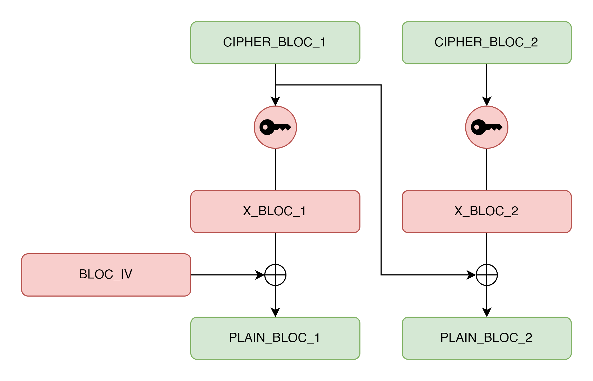
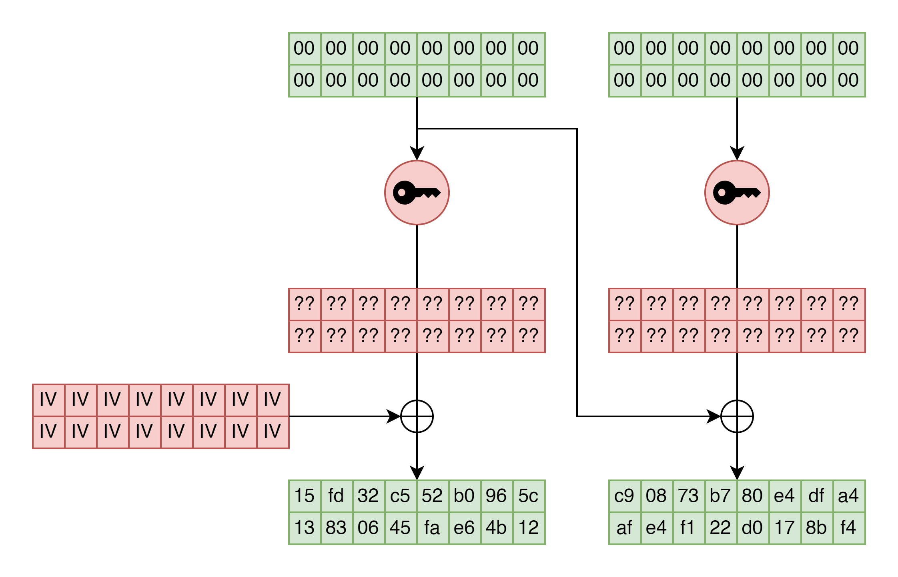
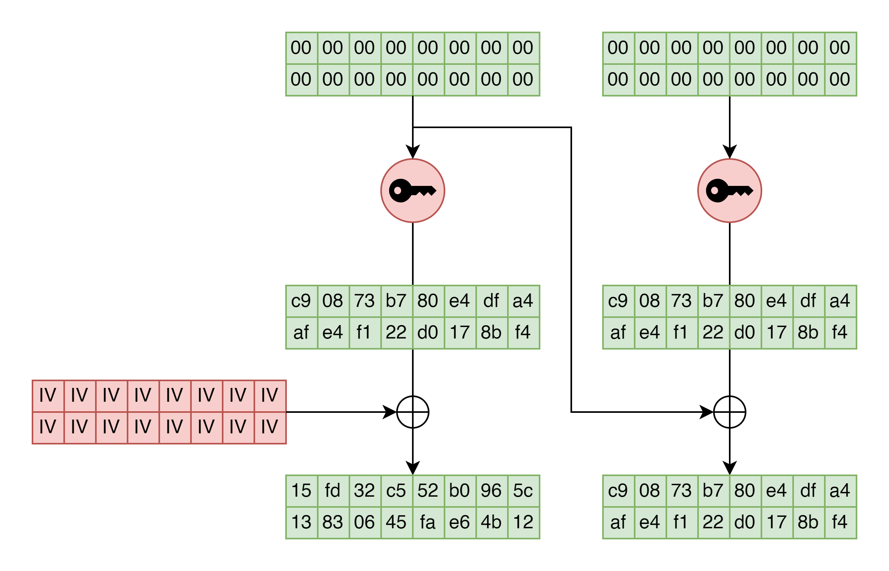
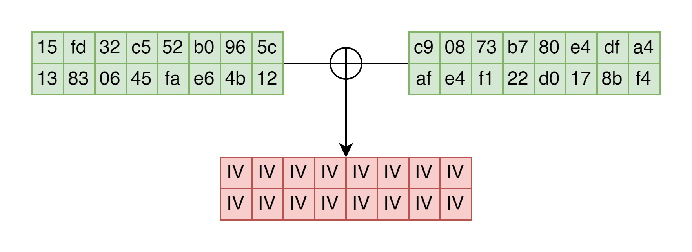


> **title:** AES IV
>
> **category:** Crypto
>
> **difficulty:** -
>
> **point:** 486
>
> **author:** -
>
> **description:**
> 
> 
>
> I lost my IV, can you help me to recover it?
>
> Auteur : Raccoon (BZHack Friends)

## Solution

Il s'agit d'AES en mode CBC. Les données chiffrées / déchiffrées sont coupées en blocs de 16 octets.

Dans le code source, on déchiffre 32 octets de valeur NULL (00). Voici des schémas pour comprendre un peu ce qu'il se passe, en vert ce sont les données que nous connaissons et en rouge les inconnues :



```
Pour déchiffrer en mode CBC, pour chaque blocs :
1. On déchiffre avec la clé
2. On xor avec le bloc chiffré précédent
   Pour le premier bloc, le xor se fait avec l'IV
```



```
Ici on sait que l'on déchiffre 32 octets, soit 2 blocs. Ces 2 blocs sont uniquement fait de valeurs 0.

On connaît également le résultat du déchiffrement, mais pas ceux de l'étape juste avant le XOR.

Or pour le second bloc, on sait que le résultat est issu du XOR avec le premier bloc chiffré, donc NULL.

Comme X XOR 0 = X, on connaît maintenant le résultat avant le XOR, qui est le même pour les 2 blocs.
```



```
Maintenant que l'on connaît le résultat du bloc 1 avant le XOR avec l'IV puis après, il suffit de faire un XOR sur les 2 pour retrouver l'IV.

Autrement dit, il faut faire un XOR entre les 16 premiers octets du résultat et les 16 suivants.
```



Voici le code Python :

```python
ciphertext = bytes.fromhex(open('output.txt').read())

bloc_1 = ciphertext[00:16]
bloc_2 = ciphertext[16:32]
iv = bytes([bloc_1[i] ^ bloc_2[i] for i in range(16)])
flag = "FLAG{" + iv.hex() + "}"
print(flag)
```

**`FLAG : FLAG{dcf54172d25449f8bc67f7672af1c0e6}`**

