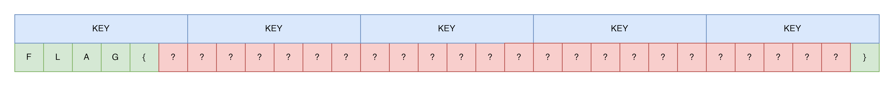


> **title:** XOR
>
> **category:** Crypto
>
> **difficulty:** -
>
> **point:** 460
>
> **author:** -
>
> **description:**
> 
> 
>
> XOR is perfect if the key length is the same as the message length, but that's a lot and I'm lazy, 6 characters is enough not to be broken by a brute-force attack.
>
> Auteur : Raccoon (BZHack Friends)

## Solution

La clé utilisé fait 6 octets.

C'est un XOR qui est fait entre la clé et le flag, donc c'est réversible.

On connaît les 5 premiers caractères du flag et le résultat du XOR, donc on peut en déduire les 5 premières octets de la clé.

Sauf que le flag fait 30 caractères (soit 5 fois la clé) et l'on connaît également le dernier caractère du flag, donc on peut en déduire le dernier octet de la clé.



En Python :

```python
from os import urandom


def xor(msg, key):
	return bytes([char^key[i%len(key)] for i, char in enumerate(msg)])


flag = "FLAG{" + urandom(12).hex() + "}"
cipher = bytes.fromhex(open("output.txt").read())

# 5 premiers octets
key = xor(flag[:5].encode(), cipher[:5])
# dernier octet
key += xor(flag[-1].encode(), bytes([cipher[-1]]))

print(xor(cipher, key).decode())
```

```
FLAG{720b1f06572a3c7335bde6d1}
```

**`FLAG : FLAG{720b1f06572a3c7335bde6d1}`**

