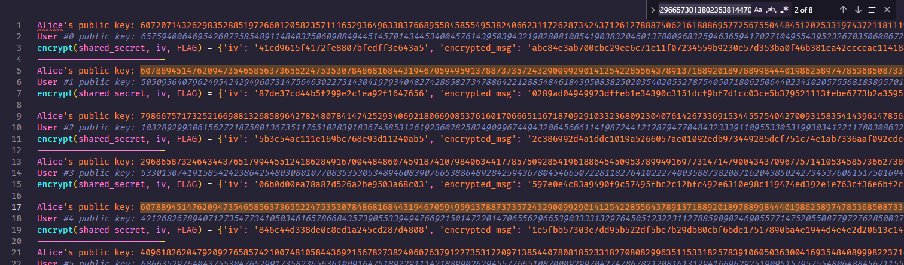


> **title:** Like a Whispering Entropy
>
> **category:** Cryptography
>
> **difficulty:** Hardcore
>
> **point:** 376
>
> **author:** ValekoZ#6741
>
> **description:**
>
> I don't trust those who wrote crypto implementations, so I had to write my own...
> 
> I created everything from scratch so I know it is safe ! No one backdoored my Diffie-Hellman implementation ! Btw, I gave you an output of a connection to my service, but anyway you won't be able to get back the secret message
> 

## Solution

Pour ce challenge, je n'ai sans doute ni assez de connaissances mathématiques, ni dans le domaine des PRNG donc on va faire une approche naïve.

Les clés publiques d'Alice sont générées à partir des **`secret_keys`**. Lorsque l'on regarde le fichier de logs, on peut voir dès les premières lignes que certaines se répètent. Si elles sont identiques, il est quasiment certains que c'est parce que la clé privée a été répétée.



**Il y a donc un problème au niveau de la génération des clés secrètes.**

Faisons un petit copié collé de la classe **`PRNG`** et générons beaucoup de clés privées :

```python    
rng = PRNG()
secret_keys = []
for i in range(2**12):  # 4096 clés générées
    secret_key = (int(rng.randint()) | 
        int(rng.randint() << 128) |
        int(rng.randint() << 256) |
        int(rng.randint() << 384) |
        int(rng.randint() << 512) |
        int(rng.randint() << 640))
    secret_keys.append(secret_key)
print(len(secret_keys))
print(len(set(secret_keys)))
```

```
4096
2612
```

On observe que sur les 4096 clés générées il n'y a que 2612 clés uniques, autant dire que presque 1 clé sur 2 répétée ça fait beaucoup là non ?

Regardons d'un peu plus près ces clés générées, à quoi ressemblent-elles ? C'est en binaire que ça devient intéressant :

```python
rng = PRNG()
for i in range(2**4):  # 16 clés générées
    secret_key = (int(rng.randint()) | 
        int(rng.randint() << 128) |
        int(rng.randint() << 256) |
        int(rng.randint() << 384) |
        int(rng.randint() << 512) |
        int(rng.randint() << 640))
    print(bin(secret_key)[2:].zfill(128))
```

```
01111111011111111111111111111111111111111011111111111111111111111111111111111111111111111111111111111111111111111111111111111111
11111111111111111111111111111111111111111111111111111111111111110110111111111111111111111111111111111111011111111111111111111111
11111111111111111111111111111111111111111111111111111111111111111111111111111111111111111111111111111111111101111111111111111111
11111111111111111111111111111111111111111111111111111111111111111111111111111111111111111111111111111111111111111111111111101111
11111111111111111111111111111110111111111111111111111111111101111111111111111111111111111111111111111111101111111111111111111111
11111111111111111111111111111111111111111111111111111111111111111111111110111111111111111111111111111111111111111111111111111111
11111111111111111111111111111111111111111111110111111111111111111111111111111111111111111111111111111111111111111111111101111111
11111111111111111111111111111111111111111111111111111111111111111111111111111111111111111111111111111111111111111111111111111111
11111111111111111111111111111111111111111111111111111111111111111111111111111111111111101111111111111111111111111111111111111111
11111111111111111111111111111101011111111111111111111111111111111111111111111111111111111011111111111111110111111011111111111111
11111111111111111111111111111111111111011111111111111110111111111111111111111111111111111111111110101111111111111111111011111111
11111111111111111111111111111111111111101111111111111111111111111111111111111111111111111111111111101111111111111111111111111111
11111111111111111111111111111111111111111111111111111111111111111111111111111111111111111111111111111111111111111111111110111111
11111111111111111111111111111111111111111111111111111111111111110111111111111111111111111111011111111111111111111111111111111111
11111111111111111111111111111111111111111111111111111111111110111111111111111111111111111111111111111111111111111110111111111111
11111111101111111111111111111111111111111111111111111111111111111111111111111111111111111011111111111111111111111111111111111111
```

**Les clés sont toutes de 128 bits avec très rarement plus d'un ou deux bits à 0.**

On peut donc essayer de bruteforcer les clés secrètes. Pour ça on va en créer une fausse clé de 128 bits avec à chaque fois un seul bit à 0 placé différement pour essayer toutes les combinaisons. Une fois ces fausses clés créées, on va toutes les tester une à une sur chaque log un à un en espérant qu'une des clés fonctionne :

```python
from hashlib import sha1
from Crypto.Cipher import AES
from Crypto.Util.Padding import unpad


# Simplement la fonction inverse de 'encrypt' de chall.sage
def decrypt(shared_secret: int, iv: bytes, ciphertext: bytes):
    key = sha1(str(shared_secret).encode('ascii')).digest()[:16]
    cipher = AES.new(key, AES.MODE_CBC, iv)
    try:
        return unpad(cipher.decrypt(ciphertext), 16).decode()
    except:
        return None

# Lecture et parsing du fichier de logs
data = open("./logs").read().splitlines()
logs = [
    {
        "alice_pk": int(data[i].split(": ")[1]),
        "user_pk": int(data[i+1].split(": ")[1]),
        "cipher": eval(data[i+2].split(" = ")[1])
    }
    for i in range(0, len(data), 4)
]

# Créations des fausses clés
secret_keys = [(2**128-1) - 2**i for i in range(128)]

# Paramètres globaux utilisés dans chall.sage
g = 2
p = 1552518092300708935130918131258481755631334049434514313202351194902966239949102107258669453876591642442910007680288864229150803718918046342632727613031282983744380820890196288509170691316593175367469551763119843371637221007210577919


for log in logs:
    for secret_key in secret_keys:
        # On calcule le secret partagé de la même façon que dans chall.sage mais avec notre fausse clé
    shared_secret = pow(log['user_pk'], secret_key, p)
    # IV utilisé pour le chiffrement (il se trouve dans les logs à chaque fois)
    iv = bytes.fromhex(log['cipher']['iv'])
    # Résultat du chiffrement, que l'on cherche justement à déchiffrer
    ciphertext = bytes.fromhex(log['cipher']['encrypted_msg'])
    # Déchiffrement
    msg = decrypt(shared_secret, iv, ciphertext)
    # Si le déchiffrement à réussi et qu'il commence par l'entête du flag
    if msg and msg.startswith("PWNME{"):
        # On affiche
        print(msg)
        exit()
```

```
PWNME{d334d082994743b12464c529ea597ed85dcd08e49e6d2d644b46f295b24a2f25}
```

**`FLAG : PWNME{d334d082994743b12464c529ea597ed85dcd08e49e6d2d644b46f295b24a2f25}`**


