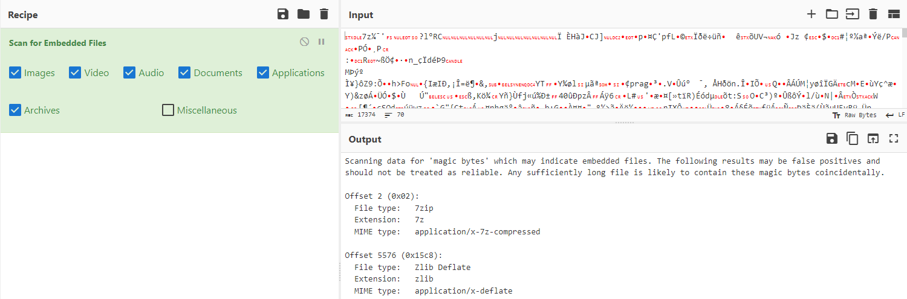


> **title:** Free flag
>
> **category:** Forensic
>
> **difficulty:** Medium
>
> **point:** 315
>
> **author:** Braguette#0169
>
> **description:**
>
> A few hours after installing the malicious package. We could notice that the traffic became weird again. Thanks to you, we know that our admin would have been compromised, we fear exfiltration! Do your job !
> 

## Solution

Commençons par savoir ce que nous avons entre les mains :

```
┌──(kali㉿kali)-[~/Desktop]
└─$ file Free\ flag 
Free flag: pcap capture file, microsecond ts (little-endian) - version 2.4 (Ethernet, capture length 262144)
```

Il s'agit donc d'un **`.pcap`**, ouvrons le avec **WireShark**. En scrollant un peu dans les requêtes, on voit énormément d'erreurs TCP entre **`192.168.157.195`** et **`10.100.210.88`** sur le port **`7435`**.


C'est très suspect, on utilise donc le filtre suivant pour les observer un peu plus :

```
ip.src == 192.168.157.195 && ip.dst == 10.100.210.88 && tcp.port == 7435
```

A chaque fois, une seule chose diffère entre les requêtes : **les flags TCP**. Et ils semblent d'autant plus suspects puisqu'ils ne respectent aucun protocole.


Comme les flags TCP se situent sur un même octet, on part de l'hypothèse que l'attaquant à exfiltrer les données en les envoyant octet par octet via les flags. Il suffirait donc de les concaténer.

En python ça nous donne :

```python
import subprocess

p = subprocess.check_output(r'tshark -r "Free flag" -Y "ip.src == 192.168.157.195 && ip.dst == 10.100.210.88 && tcp.port == 7435" -T fields -e tcp.flags', shell=True)
data = [int(n[-2:], 16) for n in p.splitlines()]
with open('unknown_file', 'wb') as f: f.write(bytearray(data))
```

On récupère donc notre fichier nommé `unknown_file`. Regardons ce qu'il est :

```
┌──(kali㉿kali)-[~/Desktop]
└─$ file unknown_file      
unknown_file: data
```

Rien du tout, passons donc à l'étape suivante : **le carving**. Pour ça, direction **[CyberChef](https://gchq.github.io/CyberChef/)**, c'est facile et rapide :



On y découvre un potentiel **`.7z`** après les 2 premiers octets. Modifions donc notre script pour les retirer et vérifier que le fichier est valide :

```python
import subprocess

p = subprocess.check_output(r'tshark -r "Free flag" -Y "ip.src == 192.168.157.195 && ip.dst == 10.100.210.88 && tcp.port == 7435" -T fields -e tcp.flags', shell=True)
data = [int(n[-2:], 16) for n in p.splitlines()]
with open('file.7z', 'wb') as f: f.write(bytearray(data)[2:])
```

En essayant de l'ouvrir avec **Winrar** :


Un **`.pdf`** se trouve à l'intérieur et en l'ouvrant on obtient notre flag :


**`FLAG : PWNME{1s_j0hN_D_R34l}`**


