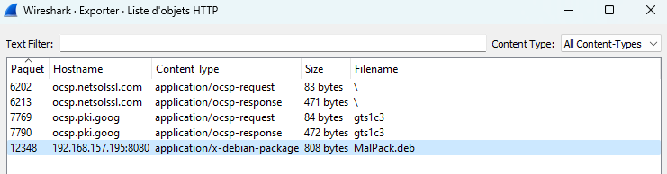


> **title:** kNOCk kNOCk
>
> **category:** Forensic
>
> **difficulty:** Intro
>
> **point:** 50
>
> **author:** Braguette#0169
>
> **description:**
>
> We have to monitor our network every day to make sure our admins don't help players get out of the game. We are sending you a suspicious capture. Do your job !
> 

## Solution

Commençons par savoir ce que nous avons entre les mains :

```
┌──(kali㉿kali)-[~/Desktop]
└─$ file kNOCk\ kNOCk 
kNOCk kNOCk: pcapng capture file - version 1.0
```

Il s'agit donc d'un **`.pcap`**, ouvrons le avec **WireShark**. On peut essayer de regarder les objets HTTP échangés dans le PCAP :



On y trouve un paquet debian nommé **`MalPack.deb`**. Pour voir ce qu'il contient, la commande :

```
dpkg-deb --extract MalPack.deb ./MalPack
```

Voici l'architecture du paquet :


Et le contenu de **`simplescript.sh`** :

```
#!/bin/bash

echo "PWNME{P4ck4g3_1s_g00d_ID}"
```


**`FLAG : PWNME{P4ck4g3_1s_g00d_ID}`**


