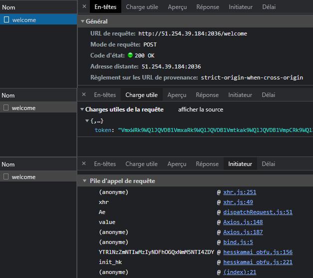
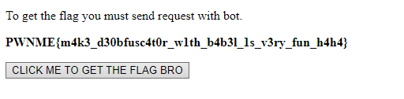


> **title:** Baby Babel
>
> **category:** Reverse
>
> **difficulty:** Medium
>
> **point:** 250
>
> **author:** Lxt3h#2690
>
> **description:**
>
> The company HessKamai has released the version 3.0 of their anti bot system.
> 
> It's currently in beta testing. Prove them they shouldn't use this version in production
> 
> You can access the website at http://51.254.39.184:2036/
> 

## Solution

Voici l'HTML du site :

```html
<!DOCTYPE html>
<html lang="en">
<head>
    <meta charset="UTF-8">
    <meta http-equiv="X-UA-Compatible" content="IE=edge">
    <meta name="viewport" content="width=device-width, initial-scale=1.0">
    <title>Best anti bot protection website</title>
</head>
<body>
    <p>To get the flag you must send request with bot.</p>
    <p><b id="msg"></b></p>
    <button id="get_flag">CLICK ME TO GET THE FLAG BRO</button>
    <input type="text" hidden id="token">
    
    <script src="https://cdn.jsdelivr.net/npm/axios/dist/axios.min.js"></script> 
    <script src="./static/hesskamai_obfu.js"></script>

    <script>        
        document.getElementById("get_flag").addEventListener('click', function(e){
            e.preventDefault()
            init_hk();
        })
    </script>
</body>
</html>
```

En cliquant sur le bouton "CLICK ME", on envoie une requête POST sur /welcome avec en body un token :



Cette requête est effectuée depuis le script `hesskamai_obfu.js`.

Le script est évidemment obfusqué comme l'indique son nom, mais plusieurs choses sautent aux yeux.

<br>

### Antidebugger

```js
setInterval(function(){
  var startTime = performance.now(), check, diff;
  for (check = 0; check < 1000; check++){
    console.clear();
  }
  diff = performance.now() - startTime;
  if (diff > 200){
    alert("Debugger detected!");
  }
}, 500);
```

Ce code permet de stopper l'exécution si le devtool est ouvert. Pour contrer ce code un peu maladroit, il suffit de stopper l'interval.

*Oui mais il faut l'ID de l'interval pour ça ?*

Effectivement, sauf que ces ID sont incrémentiels, donc il nous suffit de créer un nouvel interval, récupérer son ID et appeler la fonction `clearInterval` avec tous les ID inférieurs à celui-ci.

On entre ceci dans la console :

```js
const interval_id = window.setInterval(function(){}, Number.MAX_SAFE_INTEGER);
for (let i = 1; i <= interval_id; i++) {
  window.clearInterval(i);
}
```

<br>

### TYPES et Bits

On découvre un peu plus loin dans le code la variable **`TYPES`**.

Elle contient 2 entrées, **`flag_bit`** et **`normal_bit`**.

```js
const TYPES = {
  "flag_bit": ((169 ^ 168) >> (168 ^ 168)) + (OTZlNjRhMzk3NWIzN2M0NjUyMTdjNDAwNGQzZDExZDc3MDkyN2YyZg * -1 + OTZlNjRhMzk3NWIzN2M0NjUyMTdjNDAwNGQzZDExZDc3MDkyN2YyZg),
  "normal_bit": ((44 ^ 44) >> (44 ^ 44)) + (OTZlNjRhMzk3NWIzN2M0NjUyMTdjNDAwNGQzZDExZDc3MDkyN2YyZg * -1 + OTZlNjRhMzk3NWIzN2M0NjUyMTdjNDAwNGQzZDExZDc3MDkyN2YyZg)
};
```

En tapant TYPES dans la console, on voit que les valeurs sont les suivantes :

```js
TYPES = {
  flag_bit: 1,
  normal_bit: 0
}
```

C'est un énorme indice sur ce qu'il faut modifier.

<br>

### Obfuscation

Il y a un appel de fonction qui revient très souvent :

```js
ZTVjMGExNWMzYTA3MTcyMDNhYzE2MDM0ZGJkODIzNTIwOTQyOWEwMQ(ZTc2ODg1NjdmMDVmZmE5YTRmNWYxNGJlZWU5ZTEyZGVjMTU2OTVjOA[a ^ b])
```

Lorsque l'on évalue dans la console cet appel, on tombe sur des valeurs comme **`btoa`**, **`/welcome`** etc...

En réalité :
- **`ZTc2ODg1NjdmMDVmZmE5YTRmNWYxNGJlZWU5ZTEyZGVjMTU2OTVjOA`** est un tableau contenant des strings obfusquées
- **`ZTVjMGExNWMzYTA3MTcyMDNhYzE2MDM0ZGJkODIzNTIwOTQyOWEwMQ`** est une fonction permettant de les déobfusquer.

On va donc s'amuser à appeler cette fonction sur toutes les valeurs de notre tableau :

```js
ZTc2ODg1NjdmMDVmZmE5YTRmNWYxNGJlZWU5ZTEyZGVjMTU2OTVjOA.map(o => ZTVjMGExNWMzYTA3MTcyMDNhYzE2MDM0ZGJkODIzNTIwOTQyOWEwMQ(o))
```

On obtient :

```
[
  "fromCharCode",
  "flag_bit",
  "normal_bit",
  "/welcome",
  "0x5df1347da0cdd31a2d1c77d8ce5e4bdd65ee8effd949b841ad9a882597c97fbe",
  "l33t_Akeur",
  "floor",
  "now",
  "random",
  "",
  ".",
  ".",
  ".",
  ".",
  ".",
  "normal_bit",
  ".",
  "token",
  "post",
  "Content-Type",
  "application/json",
  "HessAk",
  "getElementById",
  "msg",
  "btoa"
]
```

Il s'agit là de l'ensemble des strings utilisées dans le script.

<br>

### Envoie du bon token

Pas besoin de reverse le token entièrement, on se doute que lorsque le notre est généré, c'est le `normal_bit` qui est envoyé. On va donc simplement remplacer `normal_bit` dans notre tableau obfusqué par `flag_bit`.

Ca tombe bien, la valeur obfusquée de `flag_bit` est déjà dans le tableau, donc pas besoin de la calculer et reverse la fonction de déobfuscation. Il suffit de la copier !

```js
ZTc2ODg1NjdmMDVmZmE5YTRmNWYxNGJlZWU5ZTEyZGVjMTU2OTVjOA[2] = ZTc2ODg1NjdmMDVmZmE5YTRmNWYxNGJlZWU5ZTEyZGVjMTU2OTVjOA[1]
```

On clique sur le bouton et le flag apparaît !



**`FLAG : PWNME{m4k3_d30bfusc4t0r_w1th_b4b3l_1s_v3ry_fun_h4h4}`**


