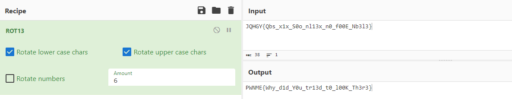


> **title:** C Stands For C
>
> **category:** Reverse
>
> **difficulty:** Intro
>
> **point:** 50
>
> **author:** Zerotistic#0001
>
> **description:**
>
> So I heard about a secret shop who uses a strong password, but it seems like they forgot you were even stronger ! Hey, if you find the password I'll give you a flag. Sounds good? Sweet!
> 

## Solution

Un simple `strings` sur le fichier permet de récupérer des informations intéressantes :

```
> strings "C Stands For C" -n 16

/lib64/ld-linux-x86-64.so.2
__stack_chk_fail
__libc_start_main
_ITM_deregisterTMCloneTable
_ITM_registerTMCloneTable
Hi, please provide the password:
JQHGY{Qbs_x1x_S0o_nl13x_n0_f00E_Nb3l3}
Welcome to the shop.
Who are you? What is your purpose here?
GCC: (Ubuntu 9.4.0-1ubuntu1~20.04.1) 9.4.0
[...]
```

On voit clairement un format de flag. Un simple ROT6 dessus permet de le récupérer en clair.

Ici on peut utiliser **[CyberChef](https://gchq.github.io/CyberChef/#recipe=ROT13(true,true,false,6)&input=SlFIR1l7UWJzX3gxeF9TMG9fbmwxM3hfbjBfZjAwRV9OYjNsM30)**



**`FLAG : PWNME{Why_d1d_Y0u_tr13d_t0_l00K_Th3r3}`**


