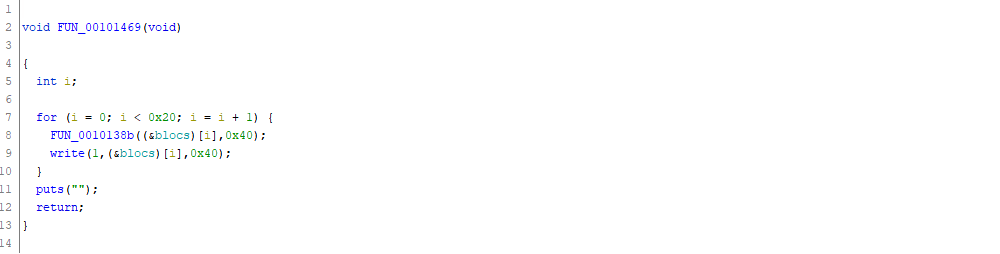


> **title:** Rottor
>
> **category:** Reverse
>
> **difficulty:** Medium
>
> **point:** 143
>
> **author:** Express#8049
>
> **description:**
>
> **Note** : *You must solve the challenge remotely when you flagged in local*
> 
> Remote service at : nc 51.254.39.184 2035
> 

## Solution

Avant tout, j'utilise **Ghidra** pour la décompilation et le challenge est réalisé en analyse statique uniquement, donc pas d'autres outils.

Commençons par décompiler le binaire. Ici j'ai lancé l'analyse avec les options par défaut :


Maintenant direction la fonction **`entry`**, c'est là que le programme commence. On voit l'appel à **`__libc_start_main`** en passant en paramètre la fonction **`FUN_00101791`**, il s'agit donc de notre **`main`** (je la renomme par la suite pour la compréhension du code).


<br>

### FUN_00101791 (main)

Accèdons au main et on commence par renommer les variables par ce qui semble logique :


On a 3 fonctions à explorer : **`FUN_001013c8`**, **`FUN_00101469`** et **`FUN_001015e6`**. Allons-y sur la première, toujours avec les petits renommages logiques :


On y découvre 2 autres fonctions (**`FUN_001012a9`** et **`FUN_0010133f`**) et une data nommée **`DAT_00104060`**. Continuons avec la première :

<br>

### FUN_001012a9 (rand)


Au moment de l'appel, on passe 0x40 (*donc 64*) en paramètre à la fonction, on va appeler ce paramètre **`n`**.
La fonction lis ensuite une taille de **`n`** de `/dev/urandom` et qu'elle place dans un buffer. Ce buffer nous est retourné à la fin.

On en déduit facilement que la fonction sert à créer un buffer d'aléatoires en donnant sa taille. On va appeler cette fonction **rand**.

<br>

### FUN_0010133f (remove_zeros)


La fonction est assez simple, elle parcourt un buffer et place -1 (0xff) à la place de tous les 0.

On va appeler cette fonction **remove_zeros**.

<br>

### FUN_0010133f (create_blocs)

Revenons à notre fonction **`FUN_001013c8`**, voici un peu ce qu'il s'y passe :


Autrement dit, cette fonctions créé 32 blocs de 64 aléatoires. Les adresses de ces 32 blocs sont situés à la suite dans **`DAT_00104060`**, que j'ai donc renommée **`blocs`**.

On va appeler cette fonction **`create_blocs`**.

<br>

### FUN_0010138b (place_zero)

Maintenant que la première fonction appelée du main est entièrement décortiquée, passons à la seconde (**`FUN_00101469`**).



 Celle-ci appelle la fonction **`FUN_0010138b`** avec en paramètres un bloc et sa taille (64) :


Même si les cast rendent la chose un peu moins lisible, on comprend tout de même :

- Un aléatoire est pris
- On applique un modulo avec la taille du bloc pour ne pas qu'il soit plus grand
- La valeur située à l'alétoire dans le bloc devient 0

Pour résumer, la fonction place un 0 aléatoirement dans le bloc. On va donc appeler cette fonction **`place_zero`**.

<br>

### FUN_00101469 (place_zero_and_print)

Revenons donc à la seconde fonction appelée dans le main (toujours **`FUN_00101469`**).


Pour les 32 blocs précèdement créés, elle place un 0 dans chacun et le print dans le STDOUT. On va appeler cette fonction **`place_zero_and_print`**.

<br>

Dernière fonction appelée par le **`main`** : la fonction **`FUN_001015e6`**. Celle-ci appelle 2 autres fonctions que nous n'avons pas encore reverse : **`FUN_0010156b`** et **`FUN_001014e6`**. Commençons par la première des deux.

<br>

### FUN_0010156b (rotate_left)

Cette fonction est appellée avec 2 arguments, le premier est un de nos blocs, le second un byte que l'on appelera **`n`**.


Il faut se souvenir que nos blocs font 65 cases et sont composé de 64 aléatoires puis 1 case "vierge". Cette dernière case sert de mémoire tampon. La fonction fait :

- Une sauvegarde de la première valeur dans la case "vierge".
- Une rotation en décalant toutes les cases vers la précèdentes.
- L'avant dernière case prend la valeur de la dernière.

En schéma ça donne ça (la case rouge est la case tampon) :


On comprend donc que cette fonction permet de faire une rotation des valeurs d'un bloc vers "la gauche". On va donc appeler cette fonction **`rotate_left`**

<br>

### FUN_001014e6 (rotate_right)


Cette fonction fait exactement la même chose mais vers "la droite". On va l'appeler **`rotate_right`**.

<br>

### FUN_001015e6 (do_stuff)

Revenons enfin à notre ultime fonction, je l'ai appelé **`do_stuff`** car c'est ici que l'input utilisateur est utilisé pour calculer un résultat devant être égal à 0 pour obtenir le flag.

J'ai commencé par un petit renommage classique avec les données que l'on connaît, puis j'ai commenté les lignes pour les expliquer un peu plus :


Alors, cette fonction récupère l'input et le découpe 3 caractères par 3. Ces groupes doivent avoir cette forme :

- Le premier est soit un 'L' soit un 'R'
- Les deux suivants sont des chiffres et forment le nombre de rotations à faire 

Les deux chiffres passent dans la fonctions **`atoi`**, qui permet de les transformer en entier (*ex: '12' deviendra 12*). 

A la fin de chaque boucle on ajoute au résultat la valeur de la case 32 du bloc courant.

**L'objectif est donc de faire les bonnes rotations pour placer le 0 du bloc à la case 32 et ainsi additionner que des 0 pour que le résultat fasse 0.**

Comme les blocs nous sont envoyés au début, on peut trouver la position de ces 0 pour calculer les rotations et envoyer le bon input, en python ça nous donne :

```python
import socket
from time import sleep

s = socket.socket(socket.AF_INET, socket.SOCK_STREAM)
s.connect(("51.254.39.184", 2035))              # Connection au serveur
sleep(.5)                                       # Le temps que le serveur envoie les données

data = s.recv(4096)                             # Réception des données
to_send = ""                                    # L'input à envoyer

step = 64                                       # Taille des blocs
for i in range(0, 2048, step):                  # Pour chaque bloc
  bloc = data[i:i+step]                         # Récupération du bloc dans les data
  index = bloc.find(b"\x00")                    # Trouve la position du 0
  rotate_by = ((0x20 - index) + 0x40) % 0x40    # Calcul de la rotation vers la droite à faire
  to_send += f"R{rotate_by:0>2}"                # Création du groupe de 3 caractères
  print(f"Bloc n°{(i//step):0>2}: {bloc.hex()} | Index = {index:0>2}")
print(f"[sending] {to_send}")
s.send(to_send.encode() + b"\n")                # Envoi des données
print(s.recv(2048).decode())                    # Réception du flag
```

**`FLAG : PWNME{C4s1n0_r0tt0r_1s_gr34t_bruuh}`**


