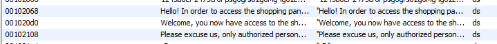
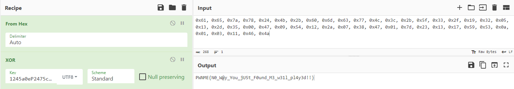


> **title:** Xoxor
>
> **category:** Reverse
>
> **difficulty:** Easy
>
> **point:** 50
>
> **author:** Zerotistic#0001
>
> **description:**
>
> I need to buy that super duper extra legendary item no matter what !
> 
> But I can't access their store... Maybe you can help me?
> 

## Solution

Ici j'utilise **Ghidra**. En ouvrant le binaire et en allant jeter un oeil dans les chaînes de caractères définies, on voit tout de suite du texte qui ressort.



Direction la fonction qui utilise ces chaînes. J'ai renommé les variables pour rendre le code plus compréhensible :

```c
void main(void) {
  int equal;
  size_t user_input_size;
  size_t size_2;
  char *flag;
  long in_FS_OFFSET;
  char user_input [264];
  long local_10;
  
  local_10 = *(long *)(in_FS_OFFSET + 0x28);
  user_input_size = strlen("aezx$K+`mcwL<+_3/\x192\x05\x13-5");
  size_2 = strlen("1245a0eP2475cr0Fpsg0grs02g0Mg4g02LOLg5gs2g0g7");
  flag = (char *)xor((long) "aezx$K+`mcwL<+_3/\x192\x05\x13-5",(long)"1245a0eP2475cr0Fpsg0grs02g0Mg4g02LOLg5gs2g0g7",
                     (int)user_input_size,(int)size_2);
  puts(
      "Hello! In order to access the shopping panel, please insert the password and do not cheat thi s time:"
      );
  fgets(user_input,0xff,stdin);
  user_input_size = strlen(user_input);
  user_input[(int)user_input_size + -1] = '\0';
  equal = strcmp(user_input,flag);
  if (equal == 0) {
    puts("Welcome, you now have access to the shopping panel.");
  }
  else {
    puts("Please excuse us, only authorized persons can access this panel.");
  }
  if (local_10 != *(long *)(in_FS_OFFSET + 0x28)) {
                    /* WARNING: Subroutine does not return */
    __stack_chk_fail();
  }
  return;
}
```

On voit que pour accèder à "Welcome", il fait que notre input soit égal au flag.

Le flag lui est le résultat d'un xor entre les chaînes :

```
"aezx$K+`mcwL<+_3/\x192\x05\x13-5"
et
"1245a0eP2475cr0Fpsg0grs02g0Mg4g02LOLg5gs2g0g7"
```

La fonction xor en question ressemble à ça :

```c
void * xor(long s1,long s2,int size_1,int size_2) {
  void *result;
  int i;
  
  result = malloc((long)size_1);
  for (i = 0; i < size_1; i = i + 1) {
    *(byte *)((long)result + (long)i) = *(byte *)(s1 + i) ^ *(byte *)(s2 + i % size_2);
  }
  return result;
}
```

Il suffit donc soit de refaire le XOR, soit de lancer le binaire avec un breakpoint lors de la comparaison pour récupérer le flag :

**[CyberChef](https://gchq.github.io/CyberChef/#recipe=From_Hex('Auto')XOR(%7B'option':'UTF8','string':'1245a0eP2475cr0Fpsg0grs02g0Mg4g02LOLg5gs2g0g7'%7D,'Standard',false)&input=MHg2MSwgMHg2NSwgMHg3YSwgMHg3OCwgMHgyNCwgMHg0YiwgMHgyYiwgMHg2MCwgMHg2ZCwgMHg2MywgMHg3NywgMHg0YywgMHgzYywgMHgyYiwgMHg1ZiwgMHgzMywgMHgyZiwgMHgxOSwgMHgzMiwgMHgwNSwgMHgxMywgMHgyZCwgMHgzNSwgMHgwMCwgMHg0NywgMHgwOSwgMHg1NCwgMHgxMiwgMHgyYSwgMHgwNywgMHgzOCwgMHg0NywgMHgwMSwgMHg3ZCwgMHgyMywgMHgxMywgMHgxNywgMHg1OSwgMHg1MywgMHgwYSwgMHgwMSwgMHgwMywgMHgxMSwgMHg0NiwgMHg0YQ)**



**`FLAG : PWNME{N0_W@y_You_jU5t_F0und_M3_w31l_pl4y3d!!}`**


