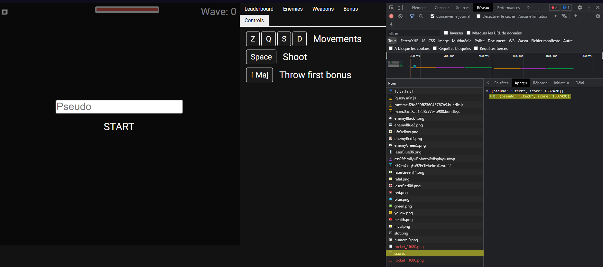
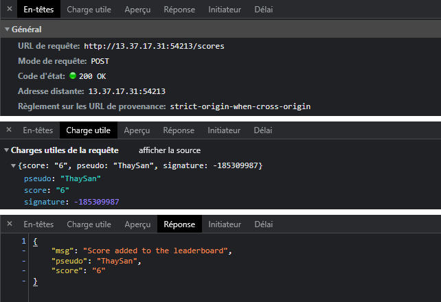
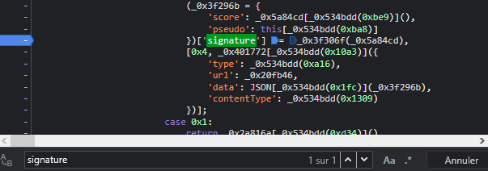
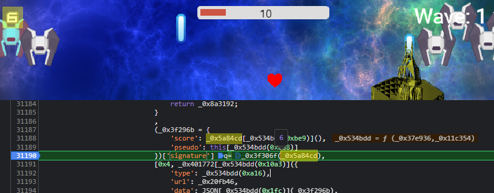
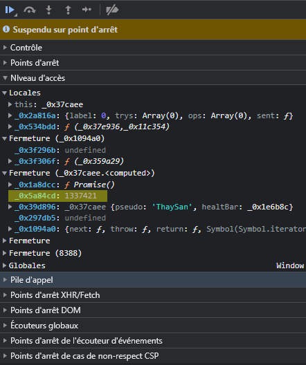
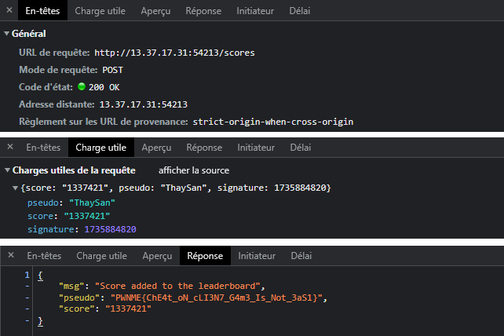


> **title:** Beat me!
>
> **category:** Web
>
> **difficulty:** Medium
>
> **point:** 50
>
> **author:** Eteck#3426
>
> **description:**
>
> A pro player challenge you to a new game. He spent a huge amount of time on it, and did an extremely good score.
> 
> Your goal is to beat him by any way
> 

## Solution

On commence par se rendre sur le site et observer le trafic. On voit une requête `GET /score` et qui nous renvoie le score du créateur :

L'objectif est de battre son score. Lançons le jeu alors pour voir ce qu'il s'y passe.

Une fois la partie terminée, une nouvelle requête est envoyée, cette fois c'est un `POST /score` avec notre score.

On peut tenter de refaire la requête en changeant simplement le score mais la signature permet au serveur de vérifier la légitimité et donc ça ne fonctionnera pas.

Fouillons un peu le code. La requête à été initiée par le script `main.xxxx.bundle.js`.

En cherchant le mot signature, on tombe miraculeusement sur une partie non obfusquée.

On place alors un breakpoint dessus et on relance une petite partie.

Quand la partie se termine, on atteint le breakpoint et on voit rapidement que la variable `_0x5a84cd` est le score envoyé au serveur (*comme le script est bundle, ce nom de variable change à chaque fois, mais pas la forme du code donc on la repère facilement*).

Il suffit de chercher le nom de cette variable dans les différents contextes en mémoire puis de modifier sa valeur.

Enfin on reprend l'exécution pour que le script calcul tout seul la bonne signature avec notre nouveau score et envoie la requête.

**`FLAG : PWNME{ChE4t_oN_cLI3N7_G4m3_Is_Not_3aS1}`**


